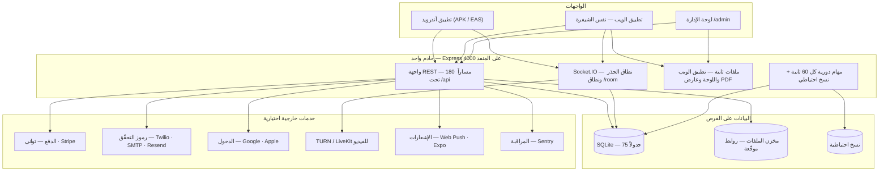
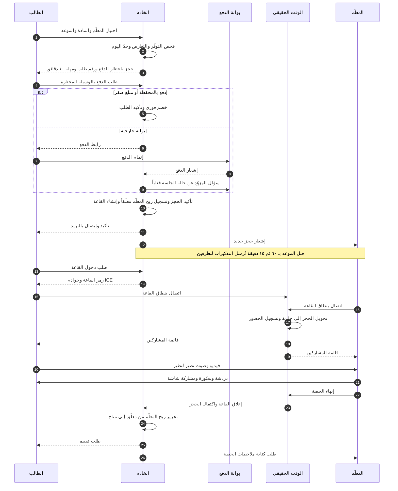

# البنية الكاملة لمنصّة «منصّة»

> وثيقة مرجعية واحدة تشرح كل جزء من المنصّة: ما هو، أين يعيش في المستودع، من يراه، وكيف تتأكّد أنه يعمل.
> كُتبت لصاحب المنصّة لا للمبرمج: كل جدول فيها يقابل شيئاً موجوداً فعلاً في الشيفرة، والأرقام محسوبة من الكود لا مقدَّرة.
>
> **تاريخ التحرير:** ٧ سبتمبر ٢٠٢٦ · **إصدار المنتج:** 2.0.0 · **إصدار مخطّط قاعدة البيانات:** 5

---

## ١) نظرة عامة ومخطط المعمارية

### ١-١ ما هي المنصّة في جملة

منصّة تعليم عُمانية واحدة تجمع أربعة أعمال في تطبيق واحد: **مكتبة كتب رقمية** تُقرأ داخل التطبيق، **دورات مصوّرة** بدروس واختبارات، **حصص خصوصية مباشرة** بالفيديو مع معلّمين معتمدين، و**متجر** يربطها كلها بمحفظة وبوابات دفع عُمانية. يعمل التطبيق على أندرويد وiOS والويب من الشيفرة نفسها، ومعه لوحة إدارة كاملة على المتصفّح.

### ١-٢ الأرقام الحقيقية للمنصّة اليوم

| البند | العدد | من أين حُسب |
|---|---|---|
| مساحات العمل (npm workspaces) | ٥ | `apps/api`، `apps/mobile`، `apps/admin`، `packages/shared`، `packages/tokens` |
| مسارات API مسجّلة | **180** | عدّ كل `router.<method>` و`app.get` في `apps/api/src` |
| جداول قاعدة البيانات | **75** | `CREATE TABLE` في `apps/api/src/db/schema.sql` |
| فهارس قاعدة البيانات | **59** | `CREATE INDEX` في `schema.sql` (٣١ منها أُضيفت في المراجعة الأخيرة) |
| ترحيلات مرقّمة | **5** | `MIGRATIONS` في `db/migrations.ts` — `SCHEMA_VERSION = 5` |
| خدمات الخادم | **22** | ملفات `apps/api/src/services/*.ts` |
| مجالات (routers) | **13** | ملفات `apps/api/src/domains/*.ts` |
| أحداث الوقت الحقيقي | **17** | نطاق الجذر ٢ + نطاق `/room` ١٥ |
| رموز أخطاء موحّدة | **31** (+١ داخلي) | تعداد `ErrorCode` في `packages/shared` |
| شاشات التطبيق | **46** | ملفات المسارات تحت `apps/mobile/app` (+٣ تخطيطات + جذر HTML) |
| مكوّنات واجهة | **44** مكوّناً في **37** ملفاً | `apps/mobile/src/ui` |
| مخازن حالة (Zustand) | **3** | `auth`، `ui`، `room` |
| فضاءات الترجمة | **37** | `packages/shared/src/i18n/ar.ts` (وما يقابلها في `en.ts`) |
| صفحات لوحة الإدارة | **15** + شاشة دخول | `apps/admin/src/pages` |
| تبويبات لوحة الإدارة | **22** | صفحة الشخص ١٠ + صفحة المعلّم ١٠ + الطلبات ٢ |
| إجراءات كاتبة في اللوحة | **59** | أزرار تستدعي API |
| تكاملات خارجية مسجّلة | **22** في **9** مجموعات | `services/integrations.ts` (محسوبة بتشغيل الدالّة) |
| مفاتيح إعدادات قابلة للتغيير من اللوحة | **10** | `DEFAULT_SETTINGS` في `config.ts` |
| متغيّرات بيئة يقرأها الخادم | **97** | `process.env.*` في `config.ts` |
| مفاتيح في قالب البيئة | **86** (`.env.example`) · **69** (`.env.production.example`) | القوالب |
| اختبارات آلية | **166** اختباراً في **26** ملفاً | `apps/api/tests/*.test.ts` — كلها تمرّ |
| سير عمل GitHub | **5** | `.github/workflows` |

### ١-٣ الطبقات

| الطبقة | التقنية | أين | ماذا تفعل |
|---|---|---|---|
| التطبيق (جوال + ويب) | Expo SDK 57 · React Native 0.86 · Expo Router · React Query 5 · Zustand 5 | `apps/mobile` | كل ما يراه الطالب ووليّ الأمر والمعلّم. الشيفرة نفسها تُصدَّر APK أندرويد وتطبيق ويب |
| الخادم | Node ≥ 22.18 · Express 4 · better-sqlite3 (WAL) · Socket.IO 4 | `apps/api` | كل المنطق والمال والملكية والحقيقة. لا شيء يُحسَب في العميل |
| لوحة الإدارة | Vite 6 · React 19 · React Router 7 · React Query 5 | `apps/admin` | تشغيل المنصّة يومياً: اعتماد المعلّمين، مراجعة المحتوى، المال، الدعم |
| العقود المشتركة | Zod 3 + قواميس عربي/إنجليزي | `packages/shared` | تعريف واحد لكل شكل بيانات ولكل نصّ ظاهر — الخادم والتطبيق واللوحة يستوردونه |
| رموز التصميم | ملف TypeScript واحد | `packages/tokens` | الألوان والمسافات والخطوط والسِمة الفاتحة/الداكنة |
| البيانات | ملف SQLite واحد + مجلّد ملفات | `DATA_DIR` (افتراضياً `apps/api/data`) | `manassah.db` + `storage/` + الأسرار المولّدة + `backups/` |

### ١-٤ مخطّط المعمارية

### ١-٥ المبادئ التي بُني عليها كل شيء

| المبدأ | كيف يظهر عملياً |
|---|---|
| الخادم هو الحقيقة الوحيدة | التسعير والخصم والضريبة والعمولة والاسترجاع وتصحيح الاختبارات وقفل الدروس — كلها في الخادم. التطبيق يعرض فقط |
| لا نصّ مكتوب داخل الشاشات | كل كلمة تمرّ عبر `packages/shared/src/i18n` (عربي وإنجليزي) |
| العربية وRTL هما الأصل | الاتجاه من اليمين افتراضياً، والأرقام لاتينية دائماً، والتوقيت `Asia/Muscat` في كل حساب |
| لا ملف خاص بلا رابط موقّع | ملفات الكتب والفيديو والمستندات تُخدَم فقط عبر `/api/files/:id` بتوقيع HMAC ينتهي خلال ١٥ دقيقة |
| كل كتابة إدارية مسجَّلة | كل مسار كتابة في لوحة الإدارة يكتب صفّاً في `audit_logs` — ويوجد اختبار يفشل إن نُسي |
| المتعلّم لا الحساب | الحساب الواحد يملك حتى ٦ متعلّمين (أبناء)؛ كل حجز وطلب وتقدّم مرتبط بمتعلّم بعينه |
| التشغيل بلا حسابات خارجية | تعمل المنصّة كاملة بلا أي مفتاح: دفع تجريبي، رمز تحقّق ثابت، قاعة فيديو داخلية، إشعارات داخل التطبيق |

---

## ٢) الأدوار والصلاحيات

### ٢-١ الأدوار الثمانية

الأدوار معرَّفة مرة واحدة في `packages/shared/src/contracts/auth.ts`، ويحملها الحساب في جدول `user_roles` (حساب واحد يمكن أن يحمل أكثر من دور).

| الدور | الاسم العربي | من يحصل عليه | أين يعمل |
|---|---|---|---|
| `student` | طالب | تلقائياً عند أول دخول | التطبيق |
| `parent` | وليّ أمر | عند إنشاء متعلّم غير ذاتي (ابن) | التطبيق |
| `teacher` | معلّم | بعد تقديم طلب انضمام واعتماده | التطبيق + تطبيق المعلّم داخله |
| `content_reviewer` | مراجع محتوى | يمنحه المدير | لوحة الإدارة |
| `support` | دعم | يمنحه المدير | لوحة الإدارة |
| `finance` | مالية | يمنحه المدير | لوحة الإدارة |
| `admin` | مدير | يمنحه `super_admin` | لوحة الإدارة (كل شيء) |
| `super_admin` | مدير أعلى | أول حساب (`ADMIN_PHONE`) أو يمنحه `super_admin` آخر | لوحة الإدارة (بلا استثناء) |

**قاعدة التمرير:** الحارس `requireRole(...)` في الخادم يمرّر `admin` و`super_admin` دائماً حتى لو لم يُذكرا. الحارس `requireExactRole(...)` لا يمرّر أحداً لم يُذكر صراحةً — يُستعمل في مسارين حسّاسين فقط.

### ٢-٢ حرّاس الخادم (`apps/api/src/lib/auth.ts`)

| الحارس | ماذا يفعل | ماذا يرجع عند الفشل |
|---|---|---|
| `attachUser` | يقرأ الرمز إن وُجد ولا يمنع | لا شيء (يستمر كزائر) |
| `requireAuth` | يفرض جلسة صالحة ويقرأ ترويسة `X-Learner-Id` | `401 unauthorized` أو `401 auth_expired` |
| `requireRole(...)` | دور من القائمة أو مدير | `403 forbidden` |
| `requireExactRole(...)` | الدور المذكور حصراً | `403 forbidden` |
| `requireVerifiedTeacher` | معلّم حالته `verified` (أو مدير) | `403 forbidden` |
| `requireLearner` | متعلّم محسوم للطلب | `422 learner_required` |

### ٢-٣ مصفوفة الأدوار × القدرات

الرمز: ✅ يستطيع · 🔸 يستطيع ضمن حدود مذكورة · ❌ لا يستطيع.

| القدرة | طالب | وليّ أمر | معلّم معتمد | مراجع محتوى | دعم | مالية | مدير | مدير أعلى |
|---|---|---|---|---|---|---|---|---|
| الدخول برمز تحقّق / Google / Apple | ✅ | ✅ | ✅ | ✅ | ✅ | ✅ | ✅ | ✅ |
| إنشاء متعلّمين (حتى ٦) وتبديل النشط | ✅ | ✅ | ✅ | ✅ | ✅ | ✅ | ✅ | ✅ |
| تصفّح المكتبة والدورات والمعلّمين | ✅ | ✅ | ✅ | ✅ | ✅ | ✅ | ✅ | ✅ |
| شراء كتاب/دورة/حصة، سلة، كوبون | ✅ | ✅ | ✅ | ✅ | ✅ | ✅ | ✅ | ✅ |
| قراءة كتاب مملوك داخل التطبيق | ✅ | ✅ | ✅ | ✅ | ✅ | ✅ | ✅ | ✅ |
| حجز حصة ودخول القاعة | ✅ | ✅ | ✅ (كمعلّم) | ✅ | ✅ | ✅ | ✅ | ✅ |
| كتابة تقييم | 🔸 بعد تجربة حقيقية | 🔸 | 🔸 | 🔸 | 🔸 | 🔸 | 🔸 | 🔸 |
| تقديم طلب انضمام معلّم | ✅ | ✅ | — | ✅ | ✅ | ✅ | ✅ | ✅ |
| ضبط التوفّر والإجازات | ❌ | ❌ | ✅ | ❌ | ❌ | ❌ | ✅ | ✅ |
| ضبط الأسعار | ❌ | ❌ | ✅ (معلّم ولو غير معتمد) | ❌ | ❌ | ❌ | ✅ | ✅ |
| إنشاء باقات حصص | ❌ | ❌ | ✅ | ❌ | ❌ | ❌ | ✅ | ✅ |
| رفع كتاب/دورة وإرسالها للمراجعة | ❌ | ❌ | ✅ | ❌ | ❌ | ❌ | ✅ | ✅ |
| كتابة ملاحظات ما بعد الحصة | ❌ | ❌ | ✅ (معلّم الحصة) | ❌ | ❌ | ❌ | ✅ | ✅ |
| إنهاء الحصة وإغلاق القاعة | ❌ | ❌ | ✅ | ❌ | ❌ | ❌ | ✅ | ✅ |
| طلب سحب الأرباح | ❌ | ❌ | ✅ | ❌ | ❌ | ❌ | ✅ | ✅ |
| رؤية أرباح المعلّم ومستنداته المالية | ❌ | ❌ | ✅ (لنفسه) | ❌ | ❌ | ✅ | ✅ | ✅ |
| رؤية مستندات هوية المعلّم | ❌ | ❌ | ❌ | ❌ | ✅ | ❌ (تُخفى منذ المراجعة) | ✅ | ✅ |
| قرار اعتماد/رفض/إيقاف معلّم | ❌ | ❌ | ❌ | ❌ | ❌ | ❌ | ✅ | ✅ |
| قبول/رفض مستند معلّم | ❌ | ❌ | ❌ | ❌ | ❌ | ❌ | ✅ | ✅ |
| مراجعة ونشر ورفض المحتوى | ❌ | ❌ | ❌ | ✅ | ❌ | ❌ | ✅ | ✅ |
| أرشفة محتوى منشور | ❌ | ❌ | ❌ | ❌ | ❌ | ❌ | ✅ | ✅ |
| قائمة الحجوزات الإدارية | ❌ | ❌ | ❌ | ❌ | ✅ | ✅ | ✅ | ✅ |
| حسم نزاع حجز | ❌ | ❌ | ❌ | ❌ | ✅ | ❌ | ✅ | ✅ |
| الطلبات والاسترجاع | ❌ | ❌ | ❌ | ❌ | ✅ (قراءة) | ✅ | ✅ | ✅ |
| تأكيد تحويل بنكي | ❌ | ❌ | ❌ | ❌ | ❌ | ✅ | ✅ | ✅ |
| تنفيذ استرجاع | ❌ | ❌ | ❌ | ❌ | ❌ | ✅ | ✅ | ✅ |
| قرارات سحوبات المعلّمين | ❌ | ❌ | ❌ | ❌ | ❌ | ✅ | ✅ | ✅ |
| الكوبونات (إنشاء/تعديل/إيقاف) | ❌ | ❌ | ❌ | ❌ | ❌ | ✅ | ✅ | ✅ |
| تعديل رصيد محفظة مستخدم | ❌ | ❌ | ❌ | ❌ | ❌ | ✅ (حصراً) | ✅ (حصراً) | ✅ (حصراً) |
| قائمة المستخدمين وصفحة الشخص | ❌ | ❌ | ❌ | ❌ | ✅ | 🔸 قراءة | ✅ | ✅ |
| إيقاف/تفعيل حساب | ❌ | ❌ | ❌ | ❌ | ❌ | ❌ | ✅ | ✅ |
| حذف حساب | ❌ | ❌ | ❌ | ❌ | ❌ | ❌ | ❌ | ✅ |
| منح/سحب أدوار المستخدمين | ❌ | ❌ | ❌ | ❌ | ❌ | ❌ | ✅ (غير أدوار الطاقم) | ✅ (كل الأدوار) |
| استبدال كل الأدوار دفعةً | ❌ | ❌ | ❌ | ❌ | ❌ | ❌ | ❌ | ✅ (حصراً) |
| إنهاء جلسات مستخدم | ❌ | ❌ | ❌ | ❌ | ✅ | ❌ | ✅ | ✅ |
| إدارة متعلّمي مستخدم نيابةً عنه | ❌ | ❌ | ❌ | ❌ | ✅ | ❌ | ✅ | ✅ |
| منح/سحب استحقاق محتوى | ❌ | ❌ | ❌ | ❌ | ❌ | ❌ | ✅ | ✅ |
| إخفاء/إظهار تقييم | ❌ | ❌ | ❌ | ❌ | ✅ | ❌ | ✅ | ✅ |
| البلاغات وحسمها | ❌ | ❌ | ❌ | ❌ | ✅ | ❌ | ✅ | ✅ |
| المنهج: إضافة دولة/منهج/صف/فصل/مادة | ❌ | ❌ | ❌ | ❌ | ❌ | ❌ | ✅ | ✅ |
| المنهج: إضافة وحدة/درس | ❌ | ❌ | ❌ | ✅ | ❌ | ❌ | ✅ | ✅ |
| قراءة الإعدادات والسياسات | ❌ | ❌ | ❌ | ❌ | ✅ | ✅ | ✅ | ✅ |
| تعديل الإعدادات والسياسات | ❌ | ❌ | ❌ | ❌ | ❌ | ❌ | ✅ | ✅ |
| صفحة الربط والخدمات والفحص والنسخ | ❌ | ❌ | ❌ | ❌ | ❌ | ❌ | ✅ | ✅ |
| سجلّ العمليات (audit) | ❌ | ❌ | ❌ | ❌ | ❌ | ❌ | ✅ | ✅ |

### ٢-٤ حرّاس إضافية تمنع الأخطاء الفادحة

| الحارس | السلوك |
|---|---|
| `self_target` | لا تستطيع تغيير حالة حسابك ولا سحب دور من نفسك |
| `last_super_admin` | لا يمكن سحب آخر `super_admin` في النظام |
| `teacher_verified` | لا يُسحب دور `teacher` من معلّم معتمد قبل إيقافه |
| `learner_limit` | ٦ متعلّمين كحدّ أقصى للحساب |
| `learner_has_upcoming` / `last_learner` | لا تُؤرشف متعلّماً له حصص قادمة، ولا آخر متعلّم في الحساب |
| حذف الحساب | يتطلّب `super_admin` + سبب إلزامي + **كتابة رقم المستخدم حرفياً** في نافذة التأكيد |
| حذف عنصر منهج | يُرفض بـ `409` مع رسالة تسمّي عدد ما يرتبط به (منذ المراجعة الأخيرة) |

---

## ٣) شجرة المستودع

الجذر: `/home/user/almshani12` — مستودع npm workspaces واحد. لا حاجة لبناء الحزم المشتركة: تُستورد كمصدر TypeScript مباشرةً.

### ٣-١ الجذر

| العنصر | ما هو |
|---|---|
| `package.json` | تعريف المساحات الخمس و**١٤ أمراً** جاهزاً (`api`, `mobile`, `admin`, `seed`, `test`, `web:build`, `docker:up` …) |
| `package-lock.json` | قفل الاعتماديات — ضروري لـ `npm ci` في CI وDocker |
| `Dockerfile` | صورة إنتاج واحدة: تبني اللوحة وتطبيق الويب ثم تشغّل الخادم على 4000 مع فحص صحّة |
| `docker-compose.yml` | تشغيل محلي/على أي خادم بأمر واحد، يمرّر ~٧٠ متغيّر بيئة بقيم افتراضية |
| `render.yaml` | نشر Render بنقرة (Blueprint) مع قرص ١ غيغابايت على `/data` |
| `fly.toml` | نشر Fly.io (منطقة `fra`، آلة `shared-cpu-1x/512mb`، حجم `data` على `/data`) |
| `README.md` | الدليل العملي: ربط الخدمات، التشغيل، النشر، APK، الخادم التجريبي |
| `deploy/` | ملفّات الخادم الخاص: `Caddyfile`، `docker-compose.prod.yml`، `README.md` (دليل VPS بسبع خطوات) |
| `docs/` | ما يُنشر على GitHub Pages: صفحة الهبوط، `go.html` الرابط الثابت، `app/` نسخة العرض، `tour/`، `BLUEPRINT.md`، وهذه الوثيقة |
| `.github/` | ٥ سير عمل + سكربتان للخادم التجريبي |
| `.live/server.json` | سجلّ الخادم التجريبي الحيّ: الحالة والعنوان ووقت الانتهاء (يكتبه سير العمل) |
| `legacy/` | نسخة سابقة من المشروع محفوظة للمرجع فقط — لا تُبنى ولا تُنشر |

### ٣-٢ `apps/api` — الخادم

| المسار | المحتوى |
|---|---|
| `src/index.ts` | تركيب Express: الوسطاء، ١٣ موجّهاً، الملفّات الثابتة، Socket.IO، المهام الدورية، الإقلاع |
| `src/config.ts` | مصدر واحد لكل إعداد: يقرأ **٩٧** متغيّر بيئة ويصدّر `config` و`DEFAULT_SETTINGS` |
| `src/domains/` | **١٣ ملفاً** = ١٣ موجّهاً: `auth`, `app`, `users`, `push`, `catalog`, `books`, `courses`, `teachers`, `bookings`, `orders`, `home`, `messages`, `admin` |
| `src/services/` | **٢٢ خدمة** تحوي المنطق: `access`, `accounts`, `backups`, `bookings`, `checkout`, `earnings`, `integrations`, `learners`, `mail`, `mappers`, `notifications`, `otp`, `otp-transports`, `payments`, `push`, `quiz`, `reminders`, `rooms`, `slots`, `storage`, `turn`, `wallet` |
| `src/lib/` | ٨ وحدات مساعدة: `audit`, `auth`, `errors`, `helpers`, `monitoring`, `social`, `validate`, `views` |
| `src/realtime/index.ts` | Socket.IO: نطاق الجذر (إشعارات وإنهاء جلسة) ونطاق `/room` (القاعة المباشرة) |
| `src/db/schema.sql` | **٧٥ جدولاً** و**٥٩ فهرساً** — المصدر الوحيد للمخطّط |
| `src/db/migrations.ts` | **٥ ترحيلات** مرقّمة + آلية النسخ الاحتياطي والتحقّق قبل كل ترقية |
| `src/db/index.ts` | فتح القاعدة، PRAGMA، دالّة `norm()` للبحث العربي، ذاكرة العبارات المُجهَّزة، ذاكرة الإعدادات |
| `src/db/seed.ts` | بذر المنهج (آمن للإنتاج) وبذر بيانات العرض وبذر أول مدير |
| `scripts/doctor.ts` | «طبيب الربط»: يفحص كل تكامل فعلياً ويطبع تقريراً |
| `tests/` | **٢٦ ملفاً**، **١٦٦ اختباراً**، على قاعدة في الذاكرة |
| `data/` | بيانات التشغيل: `manassah.db`, `storage/`, `backups/`, `.jwt_secret`, `.vapid.json` (لا تُرفع لـ git) |
| `.env.example` / `.env.production.example` | قالبا البيئة (٨٦ و٦٩ مفتاحاً) |

### ٣-٣ `apps/mobile` — التطبيق

| المسار | المحتوى |
|---|---|
| `app/` | **٤٦ شاشة** بنظام المسارات الملفّي (Expo Router) + `_layout.tsx` جذري + تخطيطا `(auth)` و`(tabs)` + `+html.tsx` |
| `src/ui/` | **٤٤ مكوّناً** في **٣٧ ملفاً** (بينها نسختا ويب لـ `PdfView` و`VideoTile`) |
| `src/features/queries.ts` | كل استعلامات وتعديلات React Query بمفاتيح موحّدة — المكان الوحيد الذي يعرف عناوين API |
| `src/features/room.ts` | منطق القاعة المباشرة: Socket.IO + WebRTC نظير-لنظير |
| `src/features/realtime.ts` | مقبس الجلسة العام (خروج فوري عند إبطال الجلسة) |
| `src/state/` | ٣ مخازن Zustand: `auth.ts`، `ui.ts`، `room.ts` |
| `src/api/client.ts` | العميل الوحيد: اختيار عنوان الخادم، تجديد الجلسة، ترويسة المتعلّم، التعافي من الأخطاء |
| `src/api/demo.ts` + `demo-data.json` | وضع العرض الكامل بلا خادم — يحاكي كل المسارات على لقطة بيانات |
| `src/lib/` | ٩ وحدات: `session`, `push`, `social`, `registry`, `prefs`, `inline`, `pdfViewer`, `format`, `hooks`, `queryClient` |
| `src/i18n/index.ts` | تهيئة i18next من القاموس المشترك + `applyLocale()` التي تضبط اللغة والاتجاه معاً |
| `app.json` / `app.config.js` | هوية التطبيق، الأذونات، الإضافات، مخطّط `manassah://` |
| `eas.json` | ملفّا بناء EAS: `preview` (APK داخلي) و`production` (app-bundle) |
| `scripts/` | `android-signing.mjs` (توقيع APK)، `check-web-build.mjs` (منع نشر نسخة العرض بالخطأ)، `single-file.mjs` (نسخة HTML واحدة) |
| `public/sw.js` | عامل الخدمة لإشعارات المتصفّح |
| `dist/` · `dist-single/` | مخرجات البناء (لا تُرفع) |

### ٣-٤ `apps/admin` — لوحة الإدارة

| المسار | المحتوى |
|---|---|
| `src/App.tsx` | الشريط الجانبي والشارات العدّية والمسارات مع **حارس دور لكل مسار** وشاشة الدخول |
| `src/api.ts` | عميل API للوحة: الرمز في `localStorage`، تجديد واحد عند 401، تنسيق المال والتواريخ |
| `src/ui.tsx` | كل العناصر المشتركة: `DataTable`, `Modal`, `Drawer`, `ConfirmDialog`, `Kpi`, `Sparkline`, `BarSeries`, `HBars`, `NoAccess`, القواميس العربية |
| `src/pages/` | **١٥ صفحة** رئيسية |
| `src/pages/parts/` | جداول مشتركة تُعاد في أكثر من صفحة: الحجوزات، الطلبات، السحوبات، البلاغات، التقييمات، السجلّ |
| `src/pages/person/` | تبويبات صفحة الشخص: الملف، الأدوار، المحفظة، الحجوزات، الامتلاك، التقييمات، الجلسات + نموذج المتعلّم |
| `src/pages/teacher/` | تبويبات صفحة المعلّم: المستندات، الأرباح، الطلاب |
| `src/styles.css` | كل الأنماط (لا مكتبة CSS) — بما فيه `.tbl { overflow-x: auto }` الذي يُبقي الجداول العريضة داخل الصفحة |

### ٣-٥ `packages/shared` و`packages/tokens`

| المسار | المحتوى |
|---|---|
| `shared/src/brand.ts` | هوية العلامة في مكان واحد: الاسم، الشعار، الألوان، العملة (`OMR`, `ر.ع`, ٣ منازل)، التوقيت `Asia/Muscat`، المخطّط `manassah` |
| `shared/src/money.ts` | حساب المال وتنسيقه — نفس الدالّة في الخادم والتطبيق واللوحة |
| `shared/src/contracts/` | **١١ ملف عقود Zod**: `common`, `auth`, `catalog`, `books`, `courses`, `teachers`, `bookings`, `orders`, `home`, `social`, `admin` |
| `shared/src/i18n/ar.ts` · `en.ts` | **٣٧ فضاءً** متطابق المفاتيح بين اللغتين |
| `tokens/src/index.ts` | الألوان (فاتح/داكن)، المسافات، الحواف، الظلال، سلّم الخط، `setTheme`, `themed`, `hitTarget` |

---

## ٤) التطبيق: كل شاشة

**بنية التنقّل:** Stack جذري بلا ترويسة يحوي مجموعة التبويبات `(tabs)`، مجموعة الدخول `(auth)`، وكل ما عداها شاشات تُدفع فوق. حارس التوجيه `AuthGate` في `app/_layout.tsx`:

| الحالة | الوجهة |
|---|---|
| بلا جلسة | `/(auth)/welcome` |
| مسجَّل بلا متعلّم وليس معلّماً ولا طاقماً | `/(auth)/setup` |
| مسجَّل وله متعلّم (أو معلّم/طاقم) | `/(tabs)` |
| المسارات المستثناة دائماً | `/connect`، `/get-app`، و**`/teacher-app/apply`** (أُضيف في المراجعة: هاتف جديد يستطيع التقديم كمعلّم دون اختراع متعلّم طالب) |

**التبويبات الخمسة:** الرئيسية · المكتبة · الحصص · الدورات · حسابي.

**الروابط العميقة:** `manassah://connect?url=…` (ربط بخادم) · `manassah://pay/success?order=…` · `manassah://pay/cancel?order=…`.

### ٤-١ مجموعة الدخول `(auth)` — ٤ شاشات

| المسار | الملف | من يراها | ماذا تعرض | الإجراءات | نقاط الـ API |
|---|---|---|---|---|---|
| `/(auth)/welcome` | `(auth)/welcome.tsx` | زائر | الشعار وجملة العلامة و٣ بلاطات تعريفية (المكتبة/الحصص/الدورات) | «ابدأ» · «لديّ حساب» · زر الاتصال بالخادم التجريبي عند غيابه · رابط `/get-app` على الويب | — |
| `/(auth)/login` | `(auth)/login.tsx` | زائر | اختيار القناة (هاتف SMS/واتساب أو بريد)، وأزرار Google وApple حين يضبطها الخادم | إرسال الرمز → `/verify` · دخول اجتماعي مباشر | `GET /auth/methods`، `GET /config`، `POST /auth/otp/request`، `POST /auth/google`، `POST /auth/apple` |
| `/(auth)/verify` | `(auth)/verify.tsx` | زائر | ٦ خانات مع تحقّق تلقائي عند اكتمال الأرقام، عدّاد إعادة إرسال ٤٥ ثانية، عرض الرمز التجريبي في وضع التطوير | تحقّق · إعادة إرسال · تغيير الرقم | `POST /auth/otp/verify`، `POST /auth/otp/request` |
| `/(auth)/setup` | `(auth)/setup.tsx` | مسجَّل بلا متعلّم (أو من الإعدادات للإضافة) | **٣ خيارات** الآن: «أنا طالب» · «أنا وليّ أمر» · **«أنا معلّم»** ← ثم نموذج المتعلّم | إنشاء متعلّم · تحديث اسم الحساب · الذهاب لنموذج الانضمام للمعلّمين | `POST /me/learners`، `PATCH /me` |

> **تغيّر في المراجعة:** سؤال «أضف ابناً آخر؟» صار يظهر بعد **كل** ابن لا بعد الأول فقط، والنموذج يختفي أثناء ظهور الورقة.

### ٤-٢ التبويبات `(tabs)` — ٥ شاشات

| المسار | الملف | من يراها | ماذا تعرض | الإجراءات | نقاط الـ API |
|---|---|---|---|---|---|
| `/` | `(tabs)/index.tsx` | الجميع | مبدّل المتعلّم أو التحية والصورة، بحث، حصّتك القادمة (بطاقة كبيرة)، ٤ بلاطات سريعة (احجز معلّماً/ملخّص/حلّ مسائل/اختبار سريع)، «أكمل دراستك»، ملخّصات الصف، دورات، معلّمون مقترحون، عرض ترويجي | فتح أي عنصر · نسخ كود العرض · دخول الحصة القادمة | `GET /home`، `GET /courses/quick-quiz/pick` |
| `/library` | `(tabs)/library.tsx` | مسجَّل | تبويب «استكشاف»/«مكتبتي»، بلاطات المواد، شرائح نوع الكتاب، شبكة كتب بتحميل تدريجي، ورقة فلاتر (صف/فصل/مجاني/تقييم/ترتيب) | فتح كتاب · قراءة | `GET /catalog/tree`، `GET /books`، `GET /me/purchases` |
| `/lessons` | `(tabs)/lessons.tsx` | مسجَّل (المعلّم المعتمد يبدّل طالب/معلّم) | تبويبات: قادمة (اليوم/غداً/الأسبوع/لاحقاً) · سابقة (بزر تقييم) · باقاتي؛ شرائح المتعلّمين عند تعدّدهم | تفاصيل الحصة · الدخول · التقييم · استعمال الباقة | `GET /bookings` (بمعامل `as=teacher` أو `learnerId`)، يُحدَّث كل ٦٠ ثانية |
| `/courses` | `(tabs)/courses.tsx` | مسجَّل | بحث، فلترة بالمادة وصف المتعلّم والترتيب، تبويب «دوراتي» | فتح دورة | `GET /courses`، `GET /catalog/tree`، `GET /me/purchases` |
| `/account` | `(tabs)/account.tsx` | مسجَّل | بطاقة الملف، بطاقة لوحة المعلّم أو «كن معلّماً»، قائمة (المتعلّمون، مشترياتي، حجوزاتي، المفضّلة، التقدّم، الإشعارات بشارة، الرسائل بشارة، المحفظة برصيدها)، الإعدادات والدعم والخصوصية والشروط، خروج، رقم الإصدار | تنقّل · تسجيل خروج | `GET /me/notifications`، `GET /me/wallet`، `GET /conversations` |

> **تغيّرات في المراجعة:** بطاقة «حصّتك القادمة» صارت تعرض **الطالب** حين يكون الحسابُ معلّمَ الحصة لا اسم المعلّم نفسه؛ شاشة الحصص تفتح في وضع المعلّم مباشرةً عند القدوم من لوحة المعلّم؛ سطر الصف في «حسابي» لم يعد يظهر لوليّ أمر (يظهر «تتابع: فلان» بدلاً منه)؛ التحية تُحسَب بتوقيت مسقط وبلا فاصلة معلّقة للحسابات بلا اسم.

### ٤-٣ الحساب `account/*` — ١٠ شاشات

| المسار | الملف | ماذا تعرض | الإجراءات | نقاط الـ API |
|---|---|---|---|---|
| `/account/favorites` | `account/favorites.tsx` | تبويبات: كتب · دورات · معلّمون | فتح · حجز | `GET /me/favorites` |
| `/account/messages` | `account/messages.tsx` | قائمة المحادثات مع غير المقروء وآخر رسالة | فتح محادثة | `GET /conversations` كل ٣٠ ثانية |
| `/account/notifications` | `account/notifications.tsx` | إشعارات بأيقونة لكل نوع؛ النقر يوجّه بحسب البيانات (حجز/محادثة/طلب/كتاب/دورة/سحب/معلّم) | «تحديد الكل كمقروء» | `GET /me/notifications`، `POST /me/notifications/read` |
| `/account/progress` | `account/progress.tsx` | هذا الأسبوع (حصص/ساعات/اختبارات/متوسط)، التقدّم حسب المادة، نقاط الضعف | — | `GET /me/progress` |
| `/account/purchases` | `account/purchases.tsx` | تبويبات: كتب · دورات · حصص · طلبات | قراءة · فتح دورة · تفاصيل حصة · تفاصيل طلب | `GET /me/purchases` |
| `/account/settings` | `account/settings.tsx` | المظهر (فاتح/داكن/تلقائي + حجم الخط)، اللغة، التنبيهات (مفتاح Push بحالاته الخمس)، **الخادم والاتصال** (عنوان مخصّص + فحص + حفظ + العودة للعرض)، اسم الملف، المتعلّمون، خروج، حذف الحساب | حفظ الاسم · تبديل اللغة · تفعيل الإشعارات · تبديل الخادم · حذف الحساب | `PATCH /me`، `DELETE /me`، `GET /push/public-key`، `POST/DELETE /me/push`، فحص مباشر لـ `/api/health` |
| `/account/wallet` | `account/wallet.tsx` | الرصيد ودفتر الحركات (شحن/شراء/استرجاع/تسوية/مكافأة) | — | `GET /me/wallet` |
| `/account/learners` | `account/learners/index.tsx` | صفّ لكل متعلّم (نقرة = تعديل، ضغطة مطوّلة = تعيين نشط)، أسهم ترتيب، حدّ ٦ | تعيين نشط · إعادة ترتيب · إضافة | `POST /me/learners/reorder`، `POST /me/learners/:id/activate` |
| `/account/learners/new` | `account/learners/new.tsx` | نموذج المتعلّم في وضع الإضافة، حوار «اجعله النشط؟» | إنشاء | `POST /me/learners` |
| `/account/learners/[id]` | `account/learners/[id].tsx` | تعديل + حذف (أرشفة) بتأكيد، مع رسائل واضحة عند وجود حصص قادمة أو كونه آخر متعلّم | تعديل · أرشفة | `PATCH /me/learners/:id`، `DELETE /me/learners/:id` |

> **تغيّرات في المراجعة:** الإشعارات غير المقروءة صارت مقروءة في الوضع الليلي (تباين ١٤:١ للعنوان)؛ إشعار «عملية بيع جديدة» للمعلّم يفتح صفحة أرباحه لا «مشترياتي» الفارغة؛ **اللغة تُحفظ** الآن وتبقى بعد إعادة التشغيل؛ شريط تبويبات «مشترياتي» صار سطراً واحداً لا يدفع القائمة لأسفل الشاشة؛ الحالة الفارغة للرسائل تُخاطب المعلّم بنصّ مناسب.

### ٤-٤ الكتب والقراءة — شاشتان

| المسار | الملف | من يراها | ماذا تعرض | الإجراءات | نقاط الـ API |
|---|---|---|---|---|---|
| `/book/[id]` | `book/[id].tsx` | مسجَّل | الغلاف (أو بديل بلون المادة)، الشارات، المؤلّف، التقييم والمبيعات والصفحات، معاينة، «ما ستتعلّمه»، المحتويات، البيانات، صفحات نموذجية، التقييمات، كتب مشابهة، من المؤلّف. الذيل: «اقرأ» أو السعر + سلة + «اشترِ الآن» | مفضّلة · سلة · شراء · قراءة · كتابة تقييم | `GET /books/:id`، `GET /cart`، `POST /cart/items`، `POST /me/favorites`، `POST /reviews` |
| `/book/[id]/read` | `book/[id]/read.tsx` | مالك الكتاب أو معاينة | قارئ PDF داخل التطبيق، علامة مائية باسم القارئ، رقم الصفحة، إشارة مرجعية، فهرس المحتويات، الانتقال لصفحة، جدار دفع عند انتهاء المعاينة | حفظ التقدّم كل صفحتين · إشارات مرجعية | `GET /books/:id/read` (رابط موقّع، لا يُخزَّن)، `PUT /books/:id/progress`، `POST /books/:id/bookmarks` |

### ٤-٥ السلة والدفع والطلب — ٥ شاشات

| المسار | الملف | ماذا تعرض | الإجراءات | نقاط الـ API |
|---|---|---|---|---|
| `/cart` | `cart.tsx` | العناصر، إزالة، كوبون، تفصيل الإجمالي | متابعة للدفع | `GET /cart`، `DELETE /cart/items/:id`، `POST /cart/coupon` |
| `/checkout` | `checkout.tsx` | ملخّص (حجز أو عناصر أو السلة)، عدّاد مهلة الحجز، كوبون، اختيار وسيلة الدفع مع شارة «وضع تجربة» وتنبيه نقص رصيد المحفظة | الدفع → صفحة الطلب، أو فتح بوابة خارجية والعودة | `GET /bookings/:id`، `GET /cart`، `POST /checkout/quote`، `GET /checkout/methods`، `GET /me/wallet`، `POST /checkout` |
| `/order/[number]` | `order/[number].tsx` | حالة الطلب: نجاح · بانتظار البوابة (استطلاع كل ٢٫٥ث وتأكيد كل ٤ث) · ملغى · تحويل بنكي بتعليماته · **فشل قابل لإعادة المحاولة أو الإلغاء**؛ ويعرض الآن سطري الخصم والضريبة فتتّسق الأرقام | الفعل التالي (اقرأ/ادخل الحصة/افتح الدورة) · فتح البوابة · فحص الحالة · إعادة المحاولة · إلغاء الطلب | `GET /orders/:number`، `POST /orders/:number/confirm`، `POST /orders/:number/cancel` |
| `/pay/success` | `pay/success.tsx` | صفحة عودة من البوابة: تؤكّد ثم تحوّل لصفحة الطلب | — | `POST /orders/:number/confirm` |
| `/pay/cancel` | `pay/cancel.tsx` | تحويل فوري لصفحة الطلب بحالة «ملغى» أو للسلة | — | — |

### ٤-٦ الاتصال والتحميل والبحث — ٤ شاشات

| المسار | الملف | من يراها | ماذا تعرض | الإجراءات | نقاط الـ API |
|---|---|---|---|---|---|
| `/connect` | `connect.tsx` | **الجميع (عام)** | التحقّق من صيغة عنوان الخادم، فحص `/api/health`، الاتصال (يحفظ العنوان ويخرج من الجلسة)، زر «افتح في التطبيق» على متصفّح الهاتف | فحص · اتصال · إلغاء | فحص مباشر لـ `/api/health` |
| `/get-app` | `get-app.tsx` | **الجميع (عام)** | على الويب: زر تحميل APK المباشر أو إصدار GitHub، الحجم ورقم البناء، رمز QR على الحاسوب، ٥ خطوات تثبيت، ملاحظة iPhone. داخل التطبيق: «مثبّت» | تحميل | `GET /app` |
| `/search` | `search.tsx` | مسجَّل | بحث موحّد بتطبيع عربي (من حرفين): معلّمون، كتب، دورات، دروس المنهج + سجلّ البحث الأخير | فتح النتيجة | `GET /catalog/search?q=` |
| `/teachers` | `teachers.tsx` | مسجَّل | بحث، شرائح المواد، «متاح الآن»، ورقة فلاتر (الصف/السعر/التقييم/النوع/الجنس/اللغة/الخبرة/الترتيب) | فتح ملف معلّم · حجز | `GET /teachers`، `GET /catalog/tree` |

### ٤-٧ الدورات والاختبارات — ٣ شاشات

| المسار | الملف | من يراها | ماذا تعرض | الإجراءات | نقاط الـ API |
|---|---|---|---|---|---|
| `/course/[id]` | `course/[id].tsx` | مسجَّل | الغلاف، المعلّم، التقييم وعدد الدروس والمدة، شريط التقدّم، الوصف، «ما ستتعلّمه»، المتطلّبات، المنهج بالأقسام (معاينة/مقفل/مكتمل)، التقييمات. الذيل: متابعة/ابدأ أو السعر + سلة + شراء | مفضّلة · سلة · شراء · فتح درس · تقييم | `GET /courses/:id`، `GET /cart`، `POST /cart/items`، `POST /me/favorites`، `POST /reviews` |
| `/course/[id]/lesson/[lessonId]` | `course/[id]/lesson/[lessonId].tsx` | مشترك أو درس معاينة | مشغّل فيديو برابط موقّع (±١٠ث، سرعات ٠٫٧٥–٢×، استئناف من آخر موضع)، أو نصّ قراءة، أو بطاقة اختبار؛ السابق/التالي/«تمّ» | حفظ الموضع كل ١٠ ثوانٍ · إكمال تلقائي عند ٩٠٪ | `GET /courses/:id/lessons/:lessonId`، `GET /courses/:id`، `PUT /courses/lessons/:id/progress` |
| `/quiz/[id]` | `quiz/[id].tsx` | مسجَّل | مقدّمة (عدد الأسئلة/درجة النجاح/الوقت/المحاولات) ← سؤال واحد في الشاشة بمؤقّت ← النتيجة (النسبة، نقاط الضعف، شرح كل سؤال، إعادة) | إرسال · إعادة المحاولة | `GET /courses/quizzes/:id`، `POST /courses/quizzes/:id/submit`، `PUT /courses/lessons/:id/progress` |

> **تغيّرات في المراجعة:** مؤقّت الاختبار ونتيجته يعرضان الثواني (لم تعد محاولة ١٢ ثانية تُقرأ «الوقت: ٠ دقيقة»)؛ وبعد الاختبار تُحدَّث بطاقات الدورة والرئيسية والمشتريات فوراً بدل أن تبقى قديمة.

### ٤-٨ الحصص المباشرة — ٥ شاشات

| المسار | الملف | من يراها | ماذا تعرض | الإجراءات | نقاط الـ API |
|---|---|---|---|---|---|
| `/lesson/[id]` | `lesson/[id].tsx` | طرفا الحجز | الحالة، المتعلّم، الموعد، المدة والنوع، السعر أو «بالباقة»، وقت فتح القاعة، الطرف الآخر مع زر مراسلة، ملاحظات الحصة والواجب والمرفقات، الحضور | دخول · تقييم · ملاحظات (معلّم) · إنهاء (معلّم) · احجز مجدداً · ادفع · إعادة جدولة · إلغاء (بحوار يذكر نسبة الاسترجاع) · إبلاغ | `GET /bookings/:id` كل ٣٠ث، `POST /bookings/:id/cancel`، `POST /bookings/:id/reschedule`، `POST /bookings/:id/end`، `GET /teachers/:id/availability`، `POST /conversations`، `POST /reports` |
| `/lesson/[id]/precall` | `lesson/[id]/precall.tsx` | طرفا الحجز | معاينة الكاميرا، فحص الكاميرا والمايك والاتصال (نبضة كل ٥ث)، عدّاد فتح القاعة | الدخول للقاعة | `GET /bookings/:id`، `GET /health` |
| `/lesson/[id]/room` | `lesson/[id]/room.tsx` | طرفا الحجز | القاعة: فيديو الطرف الآخر كبير + صورتك الصغيرة، شريط علوي (المادة/الطرف/الوقت المنقضي والمتبقّي/مؤشّر الاتصال)، **شريط ٦ أزرار في سطر واحد** (كتم · كاميرا · دردشة · المزيد · إنهاء للمضيف · مغادرة)، وورقة «المزيد» فيها اليد والمشاركون والسبّورة ومشاركة الشاشة | كل ما سبق + حوارات المغادرة والإنهاء | `GET /bookings/:id/room` ثم Socket.IO على النطاق `/room` |
| `/lesson/[id]/notes` | `lesson/[id]/notes.tsx` | **المعلّم فقط** | ملخّص الحصة والواجب والمرفقات — **يُملأ مسبقاً بما هو محفوظ** قبل السماح بالحفظ | حفظ وإرسال للطالب | `GET /bookings/:id`، `POST /files?purpose=attachment`، `POST /bookings/:id/notes` |
| `/lesson/[id]/review` | `lesson/[id]/review.tsx` | الطالب | تقييم المعلّم (نجوم + تعليق، مقفل بحجز مكتمل)، الملخّص والواجب، «احجز مجدداً» | إرسال التقييم | `GET /bookings/:id`، `POST /reviews` |

> **تغيّرات جوهرية في المراجعة:**
> 1. **ملاحظات الحصة لم تعد تمسح الواجب:** كانت الشاشة تفتح بحقول فارغة ثم يحفظ المعلّم الملخّص فيُمسح الواجب المحفوظ. الآن تُملأ الحقول من الحجز أولاً ولا يُتاح الإرسال قبل ذلك.
> 2. **الطالب لا يصل لنموذج الملاحظات:** كان يفتحه ويملأه ثم يُرفض بـ 403؛ الآن يرى رسالة صلاحية ورابط رجوع.
> 3. **القاعة تُقرأ في الوضع الليلي:** النصوص فوق المسرح الداكن صارت بيضاء ثابتة.
> 4. **كل الأزرار تظهر على شاشة ٣٩٠ بكسل** بما فيها «مغادرة» و«إنهاء الحصة» — سابقاً كانتا خارج الشاشة.
> 5. حجز موعد خلال ٢٤ ساعة يعرض تحذيراً أن الإلغاء لن يُسترجع منه شيء.

### ٤-٩ المعلّم: الملف العام والحجز — شاشتان

| المسار | الملف | ماذا تعرض | الإجراءات | نقاط الـ API |
|---|---|---|---|---|
| `/teacher/[id]` | `teacher/[id].tsx` | الصورة والاسم والعنوان المهني، شارتا «معتمد» و«متاح الآن»، شريط الأرقام (تقييم/طلاب/حصص/خبرة)، المواد والصفوف، النبذة، الأسلوب واللغات، جدول الأسعار (٣٠/٤٥/٦٠ فردي وجماعي)، الباقات، التوفّر الأسبوعي، ٧ أيام قادمة، الدورات، الكتب، التقييمات | مفضّلة · مراسلة · حجز · شراء باقة · تقييم | `GET /teachers/:id`، `POST /me/favorites`، `POST /conversations`، `POST /reviews` |
| `/teacher/[id]/book` | `teacher/[id]/book.tsx` | «لمن الحصة؟» (عند تعدّد المتعلّمين)، الباقات المملوكة، (١) المادة والنوع والمدة بسعرها، (٢) تقويم ١٤ يوماً + شبكة الأوقات، (٣) ملاحظة + سياسة الإلغاء | تأكيد ← صفحة الدفع، أو دخول مباشر إن كانت بالباقة | `GET /teachers/:id`، `GET /teachers/:id/availability`، `GET /bookings`، `POST /bookings` |

### ٤-١٠ تطبيق المعلّم `teacher-app/*` — ٥ شاشات

| المسار | الملف | من يراها | ماذا تعرض | الإجراءات | نقاط الـ API |
|---|---|---|---|---|---|
| `/teacher-app` | `teacher-app/index.tsx` | معلّم (وغير المعلّم يُحوَّل لنموذج التقديم) | حالة الاعتماد مع سبب الرفض وإعادة التقديم، ٨ بلاطات (دخل الشهر · حصص اليوم · القادمة · الطلاب · التقييم · الرصيد · كتب مُباعة · دورات)، أزرار التقويم والأرباح ورفع كتاب وحصصي، ورقة الطلاب | تنقّل | `GET /teacher/me`، `GET /teacher/students` (فقط بعد الاعتماد) |
| `/teacher-app/apply` | `teacher-app/apply.tsx` | أي مسجَّل | نموذج الانضمام: الاسم، العنوان المهني، النبذة، المؤهّل والتخصّص، الخبرة، المواد، الصفوف، الأسعار، اللغات، الجنس، المستندات (هوية/شهادة/اعتماد) | إرسال الطلب | `GET /catalog/tree`، `POST /files?purpose=document`، `POST /teacher/apply`، `GET /auth/me` |
| `/teacher-app/availability` | `teacher-app/availability.tsx` | **معلّم معتمد** | قواعد أسبوعية (اليوم/من/إلى/طول الخانة ٣٠ أو ٤٥ أو ٦٠/استراحة)، الإجازات مع عدد الحجوزات المتعارضة | حفظ القواعد · إضافة/حذف إجازة | `GET/PUT /teacher/availability`، `POST /teacher/time-off`، `DELETE /teacher/time-off/:id` |
| `/teacher-app/books` | `teacher-app/books.tsx` | **معلّم معتمد** | كتبي بحالاتها **بالعربية** (مسودة/بانتظار المراجعة/معتمد/مرفوض/منشور/مؤرشف + سبب الرفض)، رفع PDF كامل ومعاينة، إرسال للمراجعة، ورقة إنشاء كتاب | إنشاء · رفع · إرسال | `GET /books/mine`، `POST /books`، `POST /books/:id/files?kind=`، `POST /books/:id/submit`، `GET /catalog/tree` |
| `/teacher-app/earnings` | `teacher-app/earnings.tsx` | معلّم | ستّ بلاطات مال في صفّين (إجمالي · عمولة · صافي · قيد التسوية · **متاح للسحب** · **قيد السحب**)، تفصيل (حصص/كتب/دورات)، نموذج طلب سحب، **«طلبات السحب»** بحالاتها بالعربية | طلب سحب | `GET /teacher/earnings`، `POST /teacher/payouts` |

> **تغيّر مهمّ في المال:** «متاح للسحب» صار يقرأ **نفس الرصيد** الذي يخصم منه طلب السحب في الخادم، وأُضيف رقم «قيد السحب» للطلبات المقدَّمة ولم تُصرف بعد. قبل ذلك كان الرقمان مختلفَين فيطلب المعلّم مبلغاً يُرفض. كما توقّفت لوحة المعلّم غير المعتمد عن استدعاء مسار الطلاب فلم يعد يُسجَّل خطأ صلاحية عند كل فتح.

### ٤-١١ المحادثة — شاشة واحدة

| المسار | الملف | من يراها | ماذا تعرض | الإجراءات | نقاط الـ API |
|---|---|---|---|---|---|
| `/conversation/[id]` | `conversation/[id].tsx` | طرفا المحادثة | فقاعات الرسائل مع فواصل الأيام، تحديث كل ٥ ثوانٍ، حقل الإدخال في الذيل (يختفي إن فشل التحميل) | إرسال نصّ | `GET /conversations/:id/messages`، `POST /conversations/:id/messages`، `GET /conversations` |

### ٤-١٢ وضع العرض (بلا خادم)

حزمة الويب المنشورة في `docs/app` والنسخة أحادية الملف تعملان بلا خادم: `src/api/demo.ts` يحاكي كل المسارات على لقطة بيانات محفوظة في المتصفّح، ويحاكي القاعة (دخول الطرف الآخر، ردود الدردشة، رفع اليد، الإنهاء). ما لا يُحاكى: الدخول الاجتماعي، إشعارات المتصفّح، الفيديو الحقيقي، ورفع الكتب.

---

## ٥) مكوّنات الواجهة والحالة والمكتبات

### ٥-١ مكوّنات الواجهة (`apps/mobile/src/ui`) — ٤٤ مكوّناً في ٣٧ ملفاً

| المكوّن | الملف | ما يقدّمه |
|---|---|---|
| `Text` | `Text.tsx` | كل نصّ في التطبيق: `role` من سلّم الخط، `tone` (١١ نبرة)، `tabular` للأرقام، ويطبّق حجم الخط المختار من الإعدادات |
| `Icon` + `ICONS` | `Icon.tsx` | أسماء دلالية تُترجم لأيقونات Ionicons، مع قلب تلقائي للأيقونات الاتجاهية في RTL |
| `Screen` | `Screen.tsx` | حاوية كل شاشة: العنوان والرجوع والتحميل والخطأ والفراغ والسحب للتحديث والذيل |
| `Button` / `IconButton` | `Button.tsx` · `IconButton.tsx` | ٧ أنماط زر (primary/secondary/ghost/danger/info/success/soft) و٣ أحجام |
| `Input` / `SearchInput` | `Input.tsx` | حقل بعنوان وخطأ وتلميح وأيقونة؛ حقل بحث بمسح وفلاتر |
| `Card` | `Card.tsx` | البطاقة الأساسية: قابلة للضغط، بحدّ ذهبي أو شريط لون أو تظليل |
| `Chip` | `Chip.tsx` | شريحة اختيار (فلاتر، مواد، حالات) — ومساحة اللمس فيها ٤٨ نقطة فعلياً |
| `Badge` / `VerifiedBadge` | `Badge.tsx` | شارة حالة بثماني نبرات + شارة «معتمد» |
| `Avatar` / `LearnerAvatar` | `Avatar.tsx` · `LearnerAvatar.tsx` | صورة أو الحرف الأول (يتجاهل الرموز والأقواس الآن)، بأربعة أحجام |
| `Rating` | `Rating.tsx` | نجوم للعرض أو للإدخال |
| `Price` | `Price.tsx` | السعر بالريال العُماني بثلاث منازل، مع سعر مشطوب و«من» |
| `EmptyState` / `ErrorState` / `OfflineBar` | `States.tsx` | حالات الفراغ والخطأ وشريط «لا اتصال» — و«لم نجد ما تبحث عنه» صارت رسالة واحدة بزر رجوع بلا زر إعادة محاولة عبثي |
| `Skeleton` وعائلتها | `Skeleton.tsx` | هياكل تحميل: بطاقة، صفّ، شاشة كاملة |
| `Tabs` | `Tabs.tsx` | شريط تبويبات بعدّادات، قابل للتمرير أفقياً بلا أن يبتلع ارتفاع القائمة |
| `SectionHeader` | `SectionHeader.tsx` | عنوان قسم مع «عرض الكل» |
| `BookCard` / `CourseCard` / `TeacherCard` / `LessonCard` | ٤ ملفات | بطاقات المحتوى في كل القوائم؛ `LessonCard` يعرف وضع المعلّم ويعرض المتعلّم |
| `Calendar` / `TimeSlotGrid` | `Calendar.tsx` · `TimeSlot.tsx` | تقويم التوفّر (مع تعطيل أيام الإجازة) وشبكة الأوقات |
| `BottomSheet` / `Dialog` | `BottomSheet.tsx` | الورقة السفلية والحوار — كل التأكيدات تمرّ منهما |
| `ListRow` | `ListRow.tsx` | صفّ قائمة بأيقونة وقيمة وشارة |
| `HeaderActions` | `HeaderActions.tsx` | أزرار الترويسة: تبديل السِمة، الإشعارات بنقطة، السلة بعدّاد — ولا تستدعي شيئاً قبل تسجيل الدخول |
| `PdfView` | `PdfView.tsx` · `PdfView.web.tsx` | قارئ الكتب: WebView على الجوال، إطار معزول على الويب، ويعمل من الأصول المضمَّنة في النسخة أحادية الملف |
| `ReviewList` / `ReviewSheet` | `Reviews.tsx` | عرض التقييمات وورقة كتابة تقييم |
| `Expandable` | `Expandable.tsx` | نصّ طويل بأربعة أسطر وزر توسيع |
| `VideoTile` | `VideoTile.tsx` · `VideoTile.web.tsx` | بلاطة الفيديو في القاعة (كاميرا الجهاز على الجوال، `<video>` على الويب) |
| `Whiteboard` | `Whiteboard.tsx` | سبّورة بإحداثيات نسبية ترسم عبر SVG وتتزامن بين الطرفين |
| `LearnerSwitcher` / `LearnerForm` / `LearnerPicker` | ٣ ملفات | مبدّل المتعلّم النشط، نموذج المتعلّم (وفيه الآن تلميح يسمّي الحقول الناقصة)، ومنتقي المتعلّم عند الحجز |
| `LiveServerButton` | `LiveServerButton.tsx` | يتصل بالخادم التجريبي المسجَّل في `.live/server.json` |

### ٥-٢ إدارة الحالة

| النوع | الأداة | أين | ما يحفظه |
|---|---|---|---|
| حالة الخادم | React Query 5 | `src/lib/queryClient.ts` + `src/features/queries.ts` | كل شيء يأتي من API؛ صلاحية ٣٠ ثانية، إعادة محاولة واحدة، بلا إعادة جلب عند التركيز |
| حالة الجلسة | Zustand — `useAuth` | `src/state/auth.ts` | المستخدم، الجاهزية، المتعلّم النشط؛ الرموز في `SecureStore` على الجوال و`localStorage` على الويب |
| حالة الواجهة | Zustand — `useUi` | `src/state/ui.ts` | فلاتر الكتب والمعلّمين، آخر ٨ عمليات بحث، السِمة، حجم الخط، **اللغة**، عنوان الخادم، التنبيهات المنبثقة |
| حالة القاعة | Zustand — `useRoom` | `src/state/room.ts` | الاتصال، المشاركون، الرسائل (آخر ٣٠٠)، غير المقروء، اليد، المايك، الكاميرا، المشاركة، عمليات السبّورة (بحدّ ٥٠٠) |

**ما يُحفَظ على الجهاز** (مفتاح `mn_prefs`، كائن JSON واحد): السِمة · حجم الخط · **اللغة** · عنوان الخادم · المتعلّم النشط. على الويب في `localStorage` (قراءة فورية قبل الرسم لمنع وميض الوضع الليلي)، وعلى الجوال في `SecureStore`.

### ٥-٣ الوحدات المساعدة

| الوحدة | الوظيفة |
|---|---|
| `api/client.ts` | العميل الوحيد للخادم: يختار العنوان (المحفوظ ← المضمَّن ← أصل الصفحة ← المحلي)، يضيف ترويستي الجلسة والمتعلّم، يجدّد الجلسة عند انتهائها، يتعافى من متعلّم غير صالح، ويتعافى من موت نفق الخادم التجريبي عبر السجلّ |
| `api/config.ts` | يقرأ `GET /config` كل ١٠ دقائق بلا جلسة: معرّفات الدخول الاجتماعي، مفتاح الإشعارات، وسائل الدفع |
| `api/demo.ts` | وضع العرض الكامل بلا خادم |
| `features/queries.ts` | كل الاستعلامات والتعديلات بمفاتيح موحّدة، وإبطال دقيق للذاكرة بعد كل تعديل |
| `features/room.ts` | القاعة: الرمز، المقبس، WebRTC، مشاركة الشاشة، الكتم والكاميرا واليد والسبّورة والإنهاء — مع تنظيف كامل عند الخروج |
| `features/realtime.ts` | مقبس الجلسة العام: يخرجك فوراً إن أُبطلت جلستك من الإدارة |
| `lib/session.ts` | إقلاع الجلسة، الدخول، الخروج الآمن، وجهة ما بعد الدخول، وأثر تبديل المتعلّم |
| `lib/push.ts` | الإشعارات الفورية: Web Push على الويب وExpo على الجوال، بخمس حالات واضحة |
| `lib/social.ts` | Google وApple على الويب والجوال |
| `lib/registry.ts` | سجلّ الخادم التجريبي وفحصه والاتصال به |
| `lib/prefs.ts` | قراءة وكتابة التفضيلات المحفوظة |
| `lib/pdfViewer.ts` | يولّد صفحة عارض PDF ويستقبل رسائلها |
| `lib/inline.ts` | يقرأ الأصول المضمَّنة في النسخة أحادية الملف |
| `lib/format.ts` | المال، الوقت، اليوم، «اليوم/غداً»، المدة، الأرقام المختصرة، الأحرف الأولى — أرقام لاتينية وتوقيت مسقط دائماً |
| `lib/hooks.ts` | `useDebounced` و`useCountdown` |

### ٥-٤ المكتبات المستعملة

| المكتبة | الإصدار | لماذا |
|---|---|---|
| `expo` | ~57.0 | إطار التطبيق: بناء وتشغيل أندرويد وiOS والويب من شيفرة واحدة |
| `react-native` | 0.86 | الواجهة الأصلية |
| `expo-router` | ~57.0 | التنقّل بنظام الملفّات + الروابط العميقة |
| `react` / `react-dom` | 19.2 | الأساس |
| `@tanstack/react-query` | ^5.62 | حالة الخادم في التطبيق واللوحة |
| `zustand` | ^5.0 | حالة الواجهة الخفيفة |
| `i18next` + `react-i18next` | ^24 / ^15 | الترجمة |
| `zod` | ^3.24 | العقود — نفس النسخة في الطبقات الثلاث |
| `socket.io` / `socket.io-client` | ^4.8 | الوقت الحقيقي |
| `@expo/vector-icons` | ^15.1 | الأيقونات (تُستورد عائلة Ionicons وحدها لتخفيف الحزمة) |
| `expo-camera` · `expo-video` · `expo-document-picker` · `expo-secure-store` · `expo-notifications` · `expo-web-browser` · `expo-apple-authentication` · `expo-auth-session` | ~57.0 | الكاميرا، الفيديو، اختيار الملفّات، تخزين آمن، الإشعارات، بوابات الدفع، الدخول الاجتماعي |
| `react-native-svg` · `react-native-webview` · `react-native-reanimated` · `react-native-gesture-handler` | — | الرسم، عارض PDF، الحركة، الإيماءات |
| `express` | ^4.21 | الخادم |
| `better-sqlite3` | ^11.5 | قاعدة البيانات (متزامنة، سريعة، ملف واحد) |
| `helmet` · `cors` · `compression` · `express-rate-limit` | — | الحماية والأداء وتحديد المعدّل |
| `jsonwebtoken` · `jose` | ^9 / ^6 | رموز الجلسة والتحقّق من رموز Google/Apple |
| `multer` | ^2.0 | رفع الملفّات (يكتب على القرص مباشرةً الآن) |
| `nodemailer` | ^10 | البريد عبر SMTP |
| `web-push` | ^3.6 | إشعارات المتصفّح |
| `pdfjs-dist` | ^3.11 | عارض PDF يُخدَم ذاتياً |
| `qrcode` | ^1.5 | رمز QR لصفحة تحميل التطبيق |
| `@sentry/node` | ^10 | مراقبة الأخطاء (اختيارية، تُحمَّل عند الحاجة فقط) |
| `vite` · `react-router-dom` | ^6 / ^7 | بناء ومسارات لوحة الإدارة |
| `tsx` · `typescript` | ^4.19 / ~5.9 | التشغيل والفحص |

---

## ٦) لوحة الإدارة: كل صفحة وتبويب وإجراء

**العنوان:** `https://<الخادم>/admin` (أو `http://localhost:5173` أثناء التطوير).
**الدخول:** بنفس رمز التحقّق (هاتف أو بريد)؛ من لا يحمل دور طاقم يُرفض برسالة «هذا الحساب ليس من طاقم الإدارة».
**الشريط الجانبي:** يعرض شارات عدّية حيّة من `GET /admin/overview?days=14` تُحدَّث كل ٦٠ ثانية (طلبات معلّمين، محتوى، نزاعات، تحويلات بنكية، سحوبات، بلاغات).

> **تغيّر في المراجعة:** كل مسار في اللوحة صار خلف **حارس دور**؛ من يفتح قسماً ليس له يرى «لا تملك صلاحية» مع تلميح «هذا القسم متاح لأدوار أخرى — راجع مدير النظام»، بدل جدول فارغ يوحي بعدم وجود بيانات. وأي خطأ صلاحية من الخادم يُعرض بالرسالة نفسها لا بـ «لا بيانات».

### ٦-١ الصفحات الخمس عشرة

| المسار | الاسم | من يراه | الملف | ماذا فيه |
|---|---|---|---|---|
| `/` | نظرة عامة | أي طاقم | `pages/Overview.tsx` | مؤشّرات حيّة ورسوم وقوائم عمل |
| `/teachers` | المعلّمون | دعم (والمدير) | `pages/Teachers.tsx` | قائمة وفلاتر ونافذة مراجعة وقرار |
| `/teachers/:id/:tab` | صفحة المعلّم | دعم/مالية | `pages/Teacher.tsx` | ١٠ تبويبات (انظر ٦-٤) |
| `/content` | مراجعة المحتوى | مراجع محتوى | `pages/Content.tsx` | طابور الكتب والدورات وقرار النشر |
| `/bookings` | الحجوزات | دعم/مالية | `pages/Bookings.tsx` | كل الحجوزات وحسم النزاعات |
| `/orders` | الطلبات والاسترجاع | مالية/دعم | `pages/Orders.tsx` | تبويبان: الطلبات وسجلّ الاسترجاع |
| `/payouts` | سحوبات المعلّمين | مالية | `pages/Payouts.tsx` | قرارات السحب |
| `/coupons` | الكوبونات | مالية | `pages/Coupons.tsx` | إنشاء وتعديل وإيقاف |
| `/catalog` | المنهج | مدير / مراجع محتوى | `pages/Catalog.tsx` | الدول والمناهج والصفوف والفصول والمواد والوحدات والدروس |
| `/users` | المستخدمون | دعم | `pages/Users.tsx` | قائمة وفلاتر وإيقاف/تفعيل |
| `/users/:id/:tab` | صفحة الشخص | دعم/مالية | `pages/Person.tsx` | ١٠ تبويبات (انظر ٦-٣) |
| `/reports` | البلاغات | دعم | `pages/Reports.tsx` | طابور البلاغات وحسمها |
| `/settings` | الإعدادات والسياسات | مالية/دعم (التعديل للمدير) | `pages/Settings.tsx` | ١٠ مفاتيح + سياسة الإلغاء |
| `/system` | الربط والخدمات | مدير | `pages/System.tsx` | حالة ٢٢ تكاملاً والفحص والنسخ الاحتياطي |
| `/audit` | سجلّ العمليات | مدير | `pages/Audit.tsx` | كل كتابة إدارية بمنفّذها ووقتها |

### ٦-٢ ما تفعله كل صفحة

| الصفحة | ماذا تجلب | المرشّحات | الإجراءات الكاتبة |
|---|---|---|---|
| نظرة عامة | `GET /admin/overview?days=` كل ٣٠ث | مدى ٧/١٤/٣٠/٩٠ يوماً | لا شيء (قراءة فقط) |
| المعلّمون | `GET /admin/teachers` + شجرة المنهج | الحالة، بحث بالاسم أو الهاتف، المادة، الصف، أدنى تقييم، الترتيب | **٤ قرارات** كلها بنافذة تأكيد الآن: «قيد المراجعة» · **«رفض»** (سبب إلزامي يصل للمعلّم) · **«إيقاف»** (سبب إلزامي + تحذير أن الحصص القادمة تُلغى وتُسترجع) · **«اعتماد»** (يعرض نسبة العمولة في التأكيد ويرفض نسبة غير صالحة قبل الإرسال) |
| مراجعة المحتوى | `GET /admin/content?status=` | pending_review / published / rejected / draft / archived / الكل | «فتح الملف» برابط ١٥ دقيقة · **«رفض»** بنافذة تأكيد وسبب إلزامي · «اعتماد ونشر» بعد إتمام قائمة تحقّق من ٦ بنود. القرار متاح **لما هو بانتظار المراجعة فقط** — سحب منشور يمرّ بالأرشفة |
| الحجوزات | `GET /admin/bookings` | ٩ حالات + بحث | «نزاع»: استرجاع كامل للطالب / مناصفة / صرف للمعلّم، بسبب ≥٣ أحرف |
| الطلبات | `GET /admin/orders` و`GET /admin/refunds` | ٧ حالات + بحث برقم الطلب أو اسم العميل | «تأكيد التحويل» بمرجع اختياري · «استرجاع» بمبلغ اختياري (فارغ = المتبقّي) وسبب — **ويُرفض أي مبلغ يتجاوز المتبقّي القابل للاسترجاع** |
| سحوبات المعلّمين | `GET /admin/payouts?status=` | pending / approved / paid / rejected / الكل | «موافقة» · «رفض» بسبب إلزامي يصل للمعلّم · «تم الصرف» بتأكيد يوضّح أن الأرباح المتاحة تُربط بهذا الصرف |
| الكوبونات | `GET /admin/coupons` | — | **«كوبون جديد» و«تعديل»** (صار التعديل ممكناً: الرمز، النوع، القيمة، الحدود، المدى، النطاق، إظهاره في الرئيسية وعنوانه) · «إيقاف/تفعيل» |
| المنهج | `GET /catalog/tree` و`GET /catalog/units` | المنهج الحالي، ثم المادة والصف والفصل للوحدات | إضافة دولة/منهج (**باختيار الدولة الآن**)/صف/فصل/مادة · إضافة وحدة ودرس · تعديل (بتأكيد نجاح مرئي) · حذف — بما فيه **حذف الوحدات** |
| المستخدمون | `GET /admin/users` | بحث، الحالة، الدور، الترتيب | «إيقاف» بسبب إلزامي · «تفعيل» |
| البلاغات | `GET /admin/reports?status=` | open / reviewing / resolved / dismissed / الكل | «بدء المراجعة» · «حُلّ» · «رفض» (بتأكيد) · «إخفاء التقييم» بسبب إلزامي |
| الإعدادات | `GET /admin/settings` | — | «حفظ» — **الحقل الفارغ لم يعد يُحفظ صفراً**، وتُرفض سياسة إلغاء بساعات مكرّرة أو بلا قاعدة صفر |
| الربط والخدمات | `GET /admin/system` | — | «نسخة احتياطية الآن» · «فحص الاتصال الآن» (مرة كل ١٠ ثوانٍ) |
| سجلّ العمليات | `GET /admin/audit` | العملية، الكيان، المنفّذ، المستهدَف، من/إلى | لا شيء (قراءة فقط) |

### ٦-٣ صفحة الشخص `/users/:id/:tab` — ١٠ تبويبات

**الرأس:** الصورة والشارات والحالة والأدوار، سبب الإيقاف ومن أوقفه، الهاتف والبريد، تاريخ الإنشاء وآخر دخول، عدد المتعلّمين، رصيد المحفظة، المتعلّم النشط، ورابط لصفحة المعلّم إن كان معلّماً.

**إجراءات الرأس:** تعديل البيانات (مدير) · إيقاف/تفعيل (مدير، بسبب) · **حذف الحساب** (مدير أعلى، بسبب + كتابة رقم المستخدم حرفياً) · إنهاء الجلسات (دعم، مع خيار حذف رموز الإشعارات).

| التبويب | من يراه | المحتوى والإجراءات |
|---|---|---|
| الملف | الجميع | البيانات، الهويات (المعرّف مقنَّع)، الأرقام، جدول المتعلّمين. الدعم يستطيع: إضافة متعلّم · تعديل · تعيين نشط · أرشفة |
| الأدوار | الجميع (التعديل للمدير) | جدول الأدوار الثمانية بحالتها ومن منحها ومتى. منح/سحب بحوار يوضّح أن أدوار الطاقم تُنهي الجلسات وأن منح دور معلّم ينشئ ملفاً معلّقاً. أدوار الطاقم لمدير أعلى فقط |
| المحفظة | مالية أو دعم | الرصيد ودفتر الحركات مرقّماً. تعديل الرصيد (مالية) بحدّ ±٥٠٠ وملاحظة ≥٥ أحرف |
| الطلبات | مالية أو دعم | جدول الطلبات نفسه بإجراءاته |
| الحجوزات | دعم أو مالية | حجوزاته كطالب وكمعلّم (إن كان معلّماً) مع حسم النزاعات |
| الامتلاك | دعم أو مالية | الاستحقاقات والدورات (بنسبة التقدّم) والباقات والاشتراكات. المدير: منح محتوى · إلغاء استحقاق بسبب |
| التقييمات | دعم | ما كتبه وما تلقّاه كمعلّم — إخفاء بسبب وإظهار |
| البلاغات | دعم | بلاغات قدّمها وبلاغات ضدّه، بنفس الإجراءات |
| الجلسات | دعم | آخر ٥٠ جلسة والأجهزة — إنهاء جلسة واحدة أو الكل |
| السجلّ | مدير | كل ما جرى له وكل ما فعله |

### ٦-٤ صفحة المعلّم `/teachers/:id/:tab` — ١٠ تبويبات

**الرأس:** الصورة، حالة التحقّق، حالة الحساب، الجنس، التقييم، الطلاب، الحصص، العمولة، تاريخا التقديم والاعتماد، الهاتف والبريد، ورابط لصفحة المستخدم.
**إجراءات الرأس (مدير):** قرار التحقّق (لوحة جانبية بالقرار والسبب والعمولة) · تعديل (العمولة ٠–٠٫٦، العنوان المهني، التخصّص، سنوات الخبرة، بسبب ≥٣ أحرف).

| التبويب | من يراه | المحتوى والإجراءات |
|---|---|---|
| المستندات (بشارة) | الجميع | بطاقة لكل مستند بمعاينة صورة أو PDF عبر رابط ١٠ دقائق، الملاحظة، من راجعه. المدير: **قبول** بملاحظة اختيارية · **رفض مع ملاحظة** بحوار خطِر وسبب إلزامي |
| التدريس | الجميع | مصفوفة المواد × الصفوف، الأسعار، الباقات، الملف المهني |
| التوفّر | الجميع | شبكة أسبوعية ٧ أيام × ساعات ٦–٢٣، القواعد، الإجازات |
| الأرباح | مالية | مؤشّرات (مدى الحياة، متاح، معلّق، إجمالي/عمولة/صافي)، شرائح الحالة، الدفتر، وسيلة الصرف |
| السحوبات | مالية | سحوبات هذا المعلّم بنفس قرارات صفحة السحوبات |
| الحجوزات | دعم أو مالية | مؤشّرات (الكل، مكتملة، ألغاها المعلّم، لم تُحضَر، نزاعات، قادمة) + الجدول |
| التقييمات | دعم | المتوسّط والمنشور والمخفي + إخفاء/إظهار |
| الطلاب | دعم | المتعلّم، الحساب، عدد الحصص، آخر حصة |
| المحتوى | الجميع | كتب المعلّم ودوراته؛ «فتح في المراجعة» للمراجع، و«أرشفة» للمدير بتحذير أنه يختفي من المتجر ويبقى لمن اشتراه |
| السجلّ | الجميع (والسجلّ الكامل للمدير) | خطّ زمني لقرارات التحقّق |

### ٦-٥ العناصر المشتركة في اللوحة

| العنصر | ما يقدّمه |
|---|---|
| `DataTable` | جدول موحّد: أعمدة، ترقيم «N من M»، صفوف قابلة للتوسّع، حالات تحميل وفراغ **وخطأ صلاحية** |
| `ConfirmDialog` / `useConfirm` | بديل موحّد لكل تأكيد: عنوان، شرح، سبب إلزامي بحدّ أدنى، حقول إضافية، نبرة خطِرة، ونصّ يُكتب حرفياً للعمليات التي لا رجعة فيها |
| `Modal` / `Drawer` / `Field` | النوافذ واللوحات الجانبية والحقول |
| `Kpi` / `Sparkline` / `BarSeries` / `HBars` | مؤشّرات ورسوم SVG مكتوبة يدوياً بلا أي مكتبة رسم |
| `PersonLink` / `TeacherLink` / `LearnerChip` | روابط متسقة بين الصفحات |
| `NoAccess` / `ErrorState` | «لا تملك صلاحية» بدل الجدول الفارغ |
| `AR` / `ar()` / `STATUS_TONE` / `WEEKDAYS` | ترجمة كل الحالات والمصطلحات للعربية ولون كل حالة |

### ٦-٦ ما تراه اللوحة على شاشة ١٢٨٠ بكسل

الجداول العريضة (الطلبات، الحجوزات، السحوبات) تُمرَّر أفقياً **داخل إطارها** ولا تدفع الصفحة نفسها؛ أعمدة الأفعال في آخر الجدول تبقى قابلة للوصول والنقر. هذا كان أحد إصلاحات المراجعة الأخيرة.

---

## ٧) الـ API: كل مسار

**القاعدة:** `https://<الخادم>/api` · **الصيغة:** JSON · **التوثيق:** `Authorization: Bearer <رمز الوصول>` (عمره ٣٠ دقيقة، يُجدَّد تلقائياً برمز التجديد الذي يعيش ٦٠ يوماً).
**ترويسة إضافية:** `X-Learner-Id` تحدّد المتعلّم الذي يخصّه الطلب.

**الوسطاء بالترتيب:** `helmet` → `cors` → `compression` → قارئ JSON (٢ ميغابايت) → محدّد المعدّل العام (`RATE_LIMIT_API` طلباً في الدقيقة) → قارئ الجلسة الاختياري.

**شكل الخطأ الموحّد:** `{ "error": { "code": "<رمز>", "message": "<رسالة عربية>", "details": … } }`.

### ٧-١ مسارات مباشرة في `index.ts` — ٧

| الطريقة | المسار | الحارس | الغرض |
|---|---|---|---|
| GET | `/api/health` | عام | نبض الخادم: الحالة، البيئة، الوقت، إصدار المخطّط، طرق رموز التحقّق، ملخّص التكاملات |
| GET | `/api/config` | عام | ما يحتاجه التطبيق قبل الدخول: العلامة، وسائل الدفع، مزوّد القاعة، معرّفات Google/Apple، مفتاح الإشعارات — بلا أي سرّ |
| GET | `/api/files/public/:id` | عام | ملف عام (أغلفة، صور) بكاش يوم كامل |
| GET | `/api/files/:id?u&e&s` | توقيع HMAC | ملف خاص برابط موقّع ينتهي خلال ١٥ دقيقة، ويدعم التحميل الجزئي للفيديو |
| GET | `/admin/*` | عام | تطبيق لوحة الإدارة (ملفّات ثابتة) |
| GET | `/manassah.apk` | عام | ملف تثبيت أندرويد |
| GET | `/*` (ما عدا `/api` و`/admin` و`/static` و`/pay/mock`) | عام | تطبيق الويب (`index.html` بلا كاش، والحزم المُبصَمة بكاش سنة) |

### ٧-٢ الدخول — `/api/auth` — ٨

| الطريقة | المسار | الحارس | الغرض | العقد |
|---|---|---|---|---|
| GET | `/api/auth/methods` | عام | ما هو مفعّل: هاتف، واتساب، بريد، Google، Apple، ورمز تجريبي | — |
| POST | `/api/auth/otp/request` | محدّد OTP (`RATE_LIMIT_OTP` لكل ١٥ دقيقة) | طلب رمز؛ يعيد الهدف المطبَّع والمدة ووسيلة الإيصال | `OtpRequest` |
| POST | `/api/auth/otp/verify` | محدّد OTP | التحقّق وإنشاء الحساب إن لزم وإصدار الجلسة | `OtpVerify` |
| POST | `/api/auth/google` | متاح عند ضبط المعرّفات (وإلا 501) | دخول Google بالتحقّق من التوقيع لدى Google | `GoogleLogin` |
| POST | `/api/auth/apple` | متاح عند ضبط المعرّفات | دخول Apple | `AppleLogin` |
| POST | `/api/auth/refresh` | رمز التجديد | تدوير الرمز؛ إعادة استعمال رمز مُلغى تُنهي **كل** جلسات الحساب | `RefreshRequest` |
| POST | `/api/auth/logout` | جلسة | إبطال جلسة واحدة أو كلّها | — |
| GET | `/api/auth/me` | جلسة | بيانات الحساب الحالي وأدواره ومتعلّميه | — |

### ٧-٣ التطبيق — `/api` — ٢

| الطريقة | المسار | الحارس | الغرض |
|---|---|---|---|
| GET | `/api/app` | عام | هل ملف أندرويد متاح، ورابطه وحجمه ورقم بنائه ورمز QR |
| GET | `/api/app/qr.svg` | عام | رمز QR لصفحة التحميل |

### ٧-٤ الحساب والمتعلّمون — `/api` — ٢٣

| الطريقة | المسار | الحارس | الغرض | العقد |
|---|---|---|---|---|
| PATCH | `/api/me` | جلسة | الاسم واللغة والجنس والصورة | `ProfilePatch` |
| POST | `/api/me/student-setup` | جلسة | إعداد الطالب القديم (مهمل، يُبقى للتوافق) | `StudentSetup` |
| GET | `/api/me/learners` | جلسة | قائمة المتعلّمين والمتعلّم النشط | — |
| POST | `/api/me/learners` | جلسة | إنشاء متعلّم (٦ كحدّ أقصى) | `LearnerUpsert` |
| POST | `/api/me/learners/reorder` | جلسة | إعادة الترتيب | محلي |
| PATCH | `/api/me/learners/:id` | جلسة | تعديل متعلّم | `LearnerPatch` |
| DELETE | `/api/me/learners/:id` | جلسة | أرشفة متعلّم (بحرّاس الحصص القادمة وآخر متعلّم) | — |
| POST | `/api/me/learners/:id/activate` | جلسة | تعيين المتعلّم النشط | — |
| DELETE | `/api/me` | جلسة | حذف الحساب: مسح البيانات الشخصية وأرشفة المتعلّمين وإنهاء الجلسات | — |
| POST | `/api/files?purpose=` | جلسة | رفع ملف بحسب الغرض (بحدود حجم لكل غرض) | — |
| GET | `/api/me/purchases` | جلسة | الكتب والدورات والحصص والاشتراكات والطلبات | — |
| GET | `/api/me/wallet` | جلسة | الرصيد والحركات | — |
| GET | `/api/me/notifications` | جلسة | آخر ٦٠ إشعاراً وعدد غير المقروء | — |
| POST | `/api/me/notifications/read` | جلسة | تعليم إشعارات أو الكل كمقروءة | — |
| POST | `/api/me/device-tokens` | جلسة | تسجيل رمز جهاز (المسار القديم) | محلي |
| GET | `/api/me/favorites` | جلسة | المفضّلة: كتب ودورات ومعلّمون | — |
| POST | `/api/me/favorites` | جلسة | تبديل المفضّلة | `FavoriteToggle` |
| POST | `/api/reviews` | جلسة | تقييم مقفل بتجربة حقيقية (حجز مكتمل أو ملكية) | `CreateReview` |
| POST | `/api/reports` | جلسة | بلاغ عن مستخدم أو رسالة أو محتوى أو تقييم | `CreateReport` |
| POST | `/api/blocks/:id` | جلسة | حظر مستخدم | — |
| DELETE | `/api/blocks/:id` | جلسة | فكّ الحظر | — |
| POST | `/api/events` | جلسة | حدث تحليلي | `AnalyticsEvent` |
| GET | `/api/me/progress` | جلسة | لوحة التقدّم الأسبوعية وحسب المادة ونقاط الضعف | — |

**حدود الرفع لكل غرض:** صورة الملف الشخصي والغلاف ٨ ميغابايت · مستند ٢٠ · كتاب PDF ٦٠ · صفحة نموذجية ٢٠ · مرفق ٢٠ · فيديو درس حتى `UPLOAD_MAX_MB` (افتراضياً ٢٠٠). الملفّات تُكتب مباشرةً على القرص لا في الذاكرة.

### ٧-٥ الإشعارات الفورية — `/api` — ٣

| الطريقة | المسار | الحارس | الغرض | العقد |
|---|---|---|---|---|
| GET | `/api/push/public-key` | عام | المفتاح العام لإشعارات المتصفّح | — |
| POST | `/api/me/push` | جلسة | تسجيل جهاز (متصفّح أو تطبيق)، بالاحتفاظ بآخر ١٠ أجهزة | `PushRegister` |
| DELETE | `/api/me/push` | جلسة | إلغاء تسجيل جهاز | `PushUnregister` |

### ٧-٦ المنهج والبحث — `/api/catalog` — ٣

| الطريقة | المسار | الحارس | الغرض | العقد |
|---|---|---|---|---|
| GET | `/api/catalog/tree` | عام | الشجرة كاملة: الدول والمناهج والصفوف والفصول والمواد | — |
| GET | `/api/catalog/units` | عام | وحدات ودروس مادة/صف/فصل | `UnitsQuery` |
| GET | `/api/catalog/search` | اختياري | بحث موحّد بتطبيع عربي: كتب ودورات ومعلّمون ودروس منهج | محلي |

### ٧-٧ الكتب — `/api/books` — ١٠

| الطريقة | المسار | الحارس | الغرض | العقد |
|---|---|---|---|---|
| GET | `/api/books` | اختياري | قائمة مصفّاة ومرقّمة | `BooksQuery` |
| GET | `/api/books/mine` | جلسة | كتب المؤلّف بكل حالاتها (بحدّ أعلى) | — |
| GET | `/api/books/:id` | اختياري | صفحة الكتاب: الفهرس، الصفحات النموذجية الموقّعة، التقييمات، المشابه، من المؤلّف | — |
| GET | `/api/books/:id/read` | جلسة | رابط موقّع للملف الكامل (للمالك) أو للمعاينة + علامة مائية | — |
| PUT | `/api/books/:id/progress` | جلسة | آخر صفحة | `ReaderProgress` |
| POST | `/api/books/:id/bookmarks` | جلسة | تبديل إشارة مرجعية | `BookmarkToggle` |
| POST | `/api/books` | معلّم معتمد | إنشاء كتاب (مسودة) | `BookUpsert` |
| PATCH | `/api/books/:id` | معلّم معتمد + مالك | تعديل (المنشور يعود لطابور المراجعة) | `BookUpsert` |
| POST | `/api/books/:id/files?kind=` | معلّم معتمد + مالك | رفع الغلاف (عام) أو الملف الكامل/المعاينة/صفحة نموذجية (خاص) | — |
| POST | `/api/books/:id/submit` | معلّم معتمد | إرسال للمراجعة + إشعار الطاقم | — |

### ٧-٨ الدورات والاختبارات — `/api/courses` — ١٧

| الطريقة | المسار | الحارس | الغرض | العقد |
|---|---|---|---|---|
| GET | `/api/courses` | اختياري | قائمة مصفّاة | `CoursesQuery` |
| GET | `/api/courses/mine` | جلسة | دورات المعلّم | — |
| GET | `/api/courses/:id` | اختياري | صفحة الدورة: الأقسام والدروس (القفل يُحسم في الخادم) والمقدّمة المصوّرة | — |
| GET | `/api/courses/:id/lessons/:lessonId` | جلسة | تشغيل درس برابط فيديو موقّع؛ `402` إن كان مقفلاً | — |
| PUT | `/api/courses/lessons/:lessonId/progress` | جلسة | حفظ التقدّم وإعادة حساب نسبة الدورة | `LessonProgressUpdate` |
| GET | `/api/courses/quizzes/:quizId` | جلسة | الاختبار بلا إجابات | — |
| POST | `/api/courses/quizzes/:quizId/submit` | جلسة | التصحيح في الخادم مع تطبيع الإجابات العربية | `QuizSubmit` |
| GET | `/api/courses/quizzes/:quizId/attempts` | جلسة | محاولات المستخدم (بحدّ أعلى) | — |
| GET | `/api/courses/quick-quiz/pick` | جلسة | اختبار سريع من مواد المتعلّم النشط وصفّه | — |
| POST | `/api/courses` | معلّم معتمد | إنشاء دورة | محلي |
| PATCH | `/api/courses/:id` | معلّم معتمد + مالك | تعديل دورة | محلي |
| POST | `/api/courses/:id/sections` | معلّم معتمد | إضافة قسم | محلي |
| POST | `/api/courses/:id/lessons` | معلّم معتمد | إضافة درس | محلي |
| POST | `/api/courses/:id/lessons/:lessonId/video` | معلّم معتمد | رفع فيديو الدرس | — |
| POST | `/api/courses/:id/cover` | معلّم معتمد | رفع غلاف الدورة | — |
| POST | `/api/courses/quizzes` | معلّم معتمد | إنشاء اختبار بأسئلته | محلي |
| POST | `/api/courses/:id/submit` | معلّم معتمد | إرسال للمراجعة (بدرس واحد على الأقل) | — |

### ٧-٩ المعلّمون — `/api/teachers` (عام، ٣) و`/api/teacher` (خاص، ١٣)

| الطريقة | المسار | الحارس | الغرض | العقد |
|---|---|---|---|---|
| GET | `/api/teachers` | اختياري | بحث المعلّمين المعتمدين — والفلاتر «متاح الآن» و«الأقرب موعداً» تُطبَّق **قبل** التقسيم لصفحات فيصحّ العدد والترتيب | `TeachersQuery` |
| GET | `/api/teachers/:id` | اختياري | الملف العام: الأسعار، الباقات، الصفوف، الدورات، الكتب، التقييمات، معاينة التوفّر، الإحصاءات، الإجازات | — |
| GET | `/api/teachers/:id/availability` | عام | المواعيد المتاحة بتوقيت مسقط، بلا تكرار | `AvailabilityQuery` |
| POST | `/api/teacher/apply` | جلسة | طلب الانضمام + المستندات + الأسعار + المواد | `TeacherApplication` |
| GET | `/api/teacher/me` | جلسة | لوحة المعلّم: دخل الشهر، حصص اليوم، الرصيد، المستندات، آخر قرار — بحدود توقيت مسقط | — |
| GET | `/api/teacher/availability` | جلسة | القواعد والإجازات والحدّ اليومي | — |
| PUT | `/api/teacher/availability` | **معلّم معتمد** | استبدال قواعد التوفّر؛ تُرفض الفترات المتداخلة في اليوم نفسه | `AvailabilityRules` |
| POST | `/api/teacher/time-off` | **معلّم معتمد** | إضافة إجازة مع بيان الحجوزات المتعارضة | `TimeOff` |
| DELETE | `/api/teacher/time-off/:id` | **معلّم معتمد** | حذف إجازة | — |
| PUT | `/api/teacher/prices` | جلسة (معلّم) | الأسعار: ٣٠/٤٥/٦٠ دقيقة × فردي/جماعي | `LessonPrice[]` |
| POST | `/api/teacher/packages` | معلّم معتمد | باقة حصص (يجب أن تكون أرخص من مجموع الحصص) | محلي |
| DELETE | `/api/teacher/packages/:id` | جلسة (معلّم) | تعطيل باقة | — |
| GET | `/api/teacher/earnings` | جلسة (معلّم) | إجمالي/عمولة/صافي، معلّق، **متاح**، **قيد السحب**، مصروف، تفصيل، سجلّ السحوبات | — |
| POST | `/api/teacher/payouts` | معلّم معتمد | طلب سحب (بحدّ أدنى، وبالرصيد المتاح، وطلب معلّق واحد فقط) | محلي |
| GET | `/api/teacher/students` | معلّم معتمد | طلاب المعلّم كمراجع متعلّمين فقط (بلا بيانات شخصية) | — |
| GET | `/api/teacher/bookings` | جلسة (معلّم) | حصص المعلّم القادمة والسابقة | — |

### ٧-١٠ الحجوزات — `/api/bookings` — ٩ (كلّها بجلسة)

| الطريقة | المسار | الحارس الإضافي | الغرض | العقد |
|---|---|---|---|---|
| POST | `/api/bookings` | متعلّم محسوم | حجز حصة؛ يعيد الحجز ورقم الطلب ومهلة الدفع | `CreateBooking` |
| GET | `/api/bookings` | — | تبويب الحصص: قادمة (اليوم/غداً/الأسبوع/لاحقاً)، سابقة، الباقات، المتعلّمون | `LessonsQuery` |
| GET | `/api/bookings/:id` | طرف الحجز أو دعم | عرض الحجز كاملاً | — |
| POST | `/api/bookings/:id/cancel` | الطالب أو المعلّم | إلغاء بسياسة الاسترجاع — **والاسترجاع يُحسب من المبلغ المدفوع فعلاً** لا من سعر المعلّم | `CancelBooking` |
| POST | `/api/bookings/:id/reschedule` | الطالب، لحجز مؤكّد قبل النافذة المجانية | نقل الموعد داخل توفّر المعلّم | `RescheduleBooking` |
| GET | `/api/bookings/:id/room` | طرف الحجز أو إدارة | رمز دخول القاعة + خوادم ICE + اسم النطاق الحيّ | — |
| POST | `/api/bookings/:id/end` | المعلّم أو مدير | إنهاء الحصة وإغلاق القاعة وتحرير الربح | — |
| POST | `/api/bookings/:id/notes` | المعلّم | ملخّص وواجب ومرفقات + إشعار الطالب | `PostLessonNotes` |
| GET | `/api/bookings/:id/notes/files/:fileId` | الطرفان | رابط موقّع لمرفق | — |

### ٧-١١ السلة والدفع والطلبات — ١٥

| الموجّه | الطريقة | المسار | الحارس | الغرض | العقد |
|---|---|---|---|---|---|
| السلة | GET | `/api/cart` | جلسة | السلة مع التسعير الكامل | — |
| السلة | POST | `/api/cart/items` | جلسة | إضافة عنصر | `AddToCart` |
| السلة | DELETE | `/api/cart/items/:id` | جلسة | حذف عنصر | — |
| السلة | POST | `/api/cart/coupon` | جلسة | تطبيق أو إزالة كوبون | `ApplyCoupon` |
| الدفع | GET | `/api/checkout/methods` | جلسة | وسائل الدفع المتاحة ووضع كل بوابة | — |
| الدفع | POST | `/api/checkout` | جلسة | الدفع: حجز أو عناصر أو السلة. صفر ← مجاني · محفظة ← فوري · تحويل بنكي ← بانتظار المراجعة · بوابة ← رابط دفع. **فشل البوابة يعلّم الطلب «فاشلاً» فوراً فيمكن إعادة المحاولة أو الإلغاء** | `CheckoutRequest` |
| الدفع | POST | `/api/checkout/quote` | جلسة | عرض السعر قبل الدفع | محلي |
| الطلبات | GET | `/api/orders` | جلسة | آخر ١٠٠ طلب | — |
| الطلبات | GET | `/api/orders/:number` | مالك أو إدارة | طلب برقمه، ومعه رابط البوابة ووقت انتهائه | — |
| الطلبات | POST | `/api/orders/:number/cancel` | المالك | **جديد:** إلغاء طلب لم يُدفع (pending أو failed) وتحرير الموعد المحجوز معه | — |
| الطلبات | POST | `/api/orders/:number/confirm` | مالك + حدّ ٣٠ مرة/دقيقة | سؤال المزوّد عن حالة الدفع فعلياً | `OrderConfirmRequest` |
| البوابات | POST | `/api/payments/webhook/stripe` | توقيع Stripe إلزامي | تنبيه بالدفع — ثم يُسأل المزوّد قبل أي تنفيذ | — |
| البوابات | POST | `/api/payments/webhook/thawani` | توقيع HMAC إن وُجد السرّ | مُحفِّز فقط؛ الحقيقة من استعلام المزوّد | — |
| البوابات | POST | `/api/payments/mock/confirm` | غير الإنتاج | تأكيد دفعة تجريبية | محلي |
| صفحة تجريبية | GET | `/pay/mock/:number` | غير الإنتاج | صفحة بوابة تجريبية — **لم تعد تعكس أي شيء من العنوان**، والمرجع يُقرأ من قاعدة البيانات | — |

### ٧-١٢ الرئيسية والمحادثات — ٥

| الطريقة | المسار | الحارس | الغرض |
|---|---|---|---|
| GET | `/api/home` | جلسة | الرئيسية للمتعلّم النشط: التحية، الحصة القادمة، «أكمل دراستك»، ملخّصات الصف، الدورات، معلّمون مقترحون، مسائل محلولة، الرائج، العروض (بتاريخ عربي مقروء) |
| GET | `/api/conversations` | جلسة | محادثات المستخدم |
| POST | `/api/conversations` | جلسة | بدء محادثة طالب↔معلّم (المعلّم لا يبدأ إلا مع طالب حجز معه؛ والحظر يمنع) |
| GET | `/api/conversations/:id/messages?before=` | جلسة | آخر ٥٠ رسالة، وتُعلَّم كمقروءة **فقط إن وُجد غير مقروء** |
| POST | `/api/conversations/:id/messages` | جلسة | إرسال نصّ أو صورة أو ملف + إشعار |

### ٧-١٣ لوحة الإدارة — `/api/admin` — ٦٢

كل هذه المسارات خلف جلسة، ولكل واحد دوره. **وكل مسار كتابة يسجّل صفّاً في `audit_logs`** — وهناك اختبار آلي يفشل إن نُسي.

| الطريقة | المسار | الدور | الغرض |
|---|---|---|---|
| GET | `/api/admin/overview` | مراجع/دعم/مالية | نظرة عامة حيّة (بكاش ١٥ ثانية) |
| GET | `/api/admin/teachers` | دعم | قائمة المعلّمين بفلاتر وترتيب |
| GET | `/api/admin/teachers/:id` | دعم/مالية | بطاقة المعلّم الكاملة — **مستندات الهوية لا تُرسل للمالية** |
| POST | `/api/admin/teachers/:id/decision` | مدير | اعتماد/رفض/قيد المراجعة/إيقاف (الإيقاف يلغي الحصص ويسترجع بالمبلغ المدفوع فعلاً) |
| POST | `/api/admin/teachers/:id/documents/:docId/decision` | مدير | قبول أو رفض مستند |
| PATCH | `/api/admin/teachers/:id` | مدير | العمولة والعنوان المهني والتخصّص والخبرة بسبب |
| GET | `/api/admin/teachers/:id/earnings` | مالية | دفتر أرباح المعلّم مرقّماً مع الإجماليات |
| GET | `/api/admin/teachers/:id/reviews` | دعم | تقييمات المعلّم |
| GET | `/api/admin/teachers/:id/students` | دعم | طلاب المعلّم |
| GET | `/api/admin/content` | مراجع محتوى | كتب ودورات بحسب الحالة |
| GET | `/api/admin/content/:type/:id/file` | مراجع محتوى | رابط موقّع لملف الكتاب أو فيديوهات الدورة |
| POST | `/api/admin/content/:type/:id/decision` | مراجع محتوى | نشر أو رفض بقائمة تحقّق وسبب + إشعار المعلّم |
| POST | `/api/admin/content/:type/:id/archive` | مدير | أرشفة محتوى منشور |
| GET | `/api/admin/bookings` | دعم/مالية | الحجوزات بفلاتر |
| POST | `/api/admin/bookings/:id/resolve` | دعم | حسم نزاع — **يُشترط أن يكون الحجز في نزاع، ولا يُحسم مرتين** |
| GET | `/api/admin/orders` | مالية/دعم | الطلبات مع مدفوعاتها واسترجاعاتها والمتبقّي القابل للاسترجاع |
| POST | `/api/admin/orders/:id/confirm-manual` | مالية | تأكيد تحويل بنكي |
| POST | `/api/admin/orders/:id/refund` | مالية | استرجاع — **بسقف = المدفوع ناقص ما استُرجع** |
| GET | `/api/admin/refunds` | مالية | آخر ٢٠٠ استرجاع |
| GET | `/api/admin/payouts` | مالية | طلبات السحب |
| POST | `/api/admin/payouts/:id/decision` | مالية | موافقة/رفض/صرف |
| GET | `/api/admin/system` | مدير | حالة النظام والتكاملات والنشر والنسخ — بلا أسرار |
| POST | `/api/admin/system/check` | مدير | فحص التكاملات فعلياً (مرة كل ١٠ ثوانٍ) |
| POST | `/api/admin/system/backup` | مدير | نسخة احتياطية فورية |
| GET | `/api/admin/settings` | مالية/دعم | كل الإعدادات |
| PUT | `/api/admin/settings` | مدير | تعديل المفاتيح العشرة والسياسة |
| POST | `/api/admin/catalog/countries` | مدير | إضافة دولة |
| POST | `/api/admin/catalog/curriculums` | مدير | إضافة منهج |
| POST | `/api/admin/catalog/grades` | مدير | إضافة صف |
| POST | `/api/admin/catalog/semesters` | مدير | إضافة فصل |
| POST | `/api/admin/catalog/subjects` | مدير | إضافة مادة |
| POST | `/api/admin/catalog/units` | مدير/مراجع | إضافة وحدة |
| POST | `/api/admin/catalog/lessons` | مدير/مراجع | إضافة درس منهج |
| PATCH | `/api/admin/catalog/:kind/:id` | مدير | تعديل — **مُتحقَّق منه الآن**: الاسم لا يكون فارغاً، والأعمدة المسموحة تختلف بحسب النوع |
| DELETE | `/api/admin/catalog/:kind/:id` | مدير | حذف — **يُرفض بـ 409 مع بيان ما يرتبط به** بدل تفكيك بيانات المتعلّمين والمعلّمين |
| GET | `/api/admin/coupons` | مالية | الكوبونات |
| POST | `/api/admin/coupons` | مالية | إنشاء كوبون |
| PATCH | `/api/admin/coupons/:id` | مالية | **تعديل كامل** أو تفعيل/إيقاف |
| GET | `/api/admin/users` | دعم | قائمة المستخدمين |
| GET | `/api/admin/users/:id` | دعم/مالية | صفحة الشخص |
| PATCH | `/api/admin/users/:id/profile` | مدير (المدير الأعلى لحسابات الطاقم) | الهاتف والبريد والاسم واللغة والمنطقة |
| POST | `/api/admin/users/:id/status` | مدير (الحذف لمدير أعلى) | تفعيل/إيقاف/حذف + إنهاء الجلسات فوراً |
| POST | `/api/admin/users/:id/roles/grant` | مدير (أدوار الطاقم لمدير أعلى) | منح دور |
| POST | `/api/admin/users/:id/roles/revoke` | مدير | سحب دور بحرّاسه |
| POST | `/api/admin/users/:id/roles` | **مدير أعلى حصراً** | استبدال كل الأدوار (مسار قديم) |
| GET | `/api/admin/users/:id/wallet` | مالية/دعم | دفتر المحفظة |
| POST | `/api/admin/users/:id/wallet/adjust` | **مالية/مدير/مدير أعلى حصراً** | تعديل الرصيد + إشعار المستخدم |
| GET | `/api/admin/users/:id/entitlements` | دعم/مالية | الاستحقاقات والتسجيلات والباقات والاشتراكات |
| POST | `/api/admin/users/:id/grant` | مدير | منح استحقاق محتوى |
| DELETE | `/api/admin/users/:id/entitlements/:entId` | مدير | سحب استحقاق بسبب |
| GET | `/api/admin/users/:id/reviews` | دعم | تقييمات كتبها أو تلقّاها |
| POST | `/api/admin/reviews/:id/hide` | دعم | إخفاء تقييم وإعادة حساب المتوسّط |
| POST | `/api/admin/reviews/:id/unhide` | دعم | إظهار تقييم |
| GET | `/api/admin/users/:id/sessions` | دعم | الجلسات والأجهزة |
| POST | `/api/admin/users/:id/sessions/revoke` | دعم | إنهاء جلسة أو الكل |
| POST | `/api/admin/users/:id/learners` | دعم | إنشاء متعلّم نيابةً |
| PATCH | `/api/admin/users/:id/learners/:lid` | دعم | تعديل متعلّم |
| DELETE | `/api/admin/users/:id/learners/:lid` | دعم | أرشفة متعلّم |
| POST | `/api/admin/users/:id/learners/:lid/activate` | دعم | تعيين المتعلّم النشط |
| GET | `/api/admin/reports` | دعم | البلاغات مع هدفها |
| POST | `/api/admin/reports/:id/status` | دعم | مراجعة/حلّ/رفض |
| GET | `/api/admin/audit` | مدير | سجلّ العمليات مرقّماً بفلاتر |

**المجموع:** ٧ + ٨ + ٢ + ٢٣ + ٣ + ٣ + ١٠ + ١٧ + ١٦ + ٩ + ١٥ + ١ + ٤ + ٦٢ = **١٨٠ مساراً**.

---

## ٨) الوقت الحقيقي (Socket.IO)

المسار `/socket.io`. نطاقان: نطاق الجذر للإشعارات، ونطاق `/room` للقاعة المباشرة.

### ٨-١ نطاق الجذر — للإشعارات وإنهاء الجلسة

**التوثيق:** رمز الجلسة في `auth.token`؛ يُضمّ المقبس لغرفة خاصة بالمستخدم.

| الاتجاه | الحدث | الحمولة | متى |
|---|---|---|---|
| خادم ← عميل | `notification` | الإشعار كاملاً مع بياناته | عند كل إشعار جديد (حجز، رسالة، واجب، بيع، قرار، سحب…) |
| خادم ← عميل | `session_revoked` | `{ reason: 'force_logout' \| 'suspended' \| 'deleted' }` | عند إنهاء الجلسات أو إيقاف/حذف الحساب من الإدارة — التطبيق يخرج فوراً |

### ٨-٢ نطاق `/room` — القاعة المباشرة

**التوثيق:** رمز القاعة `auth.roomToken` (المزوّد الداخلي) أو رمز الجلسة + رقم الحجز (المزوّد الخارجي). أخطاء الاتصال: `unauthorized`، `room_token_invalid`، `room_closed`. الدخول ينقل الحجز تلقائياً إلى «جارية».

| الاتجاه | الحدث | الحمولة | ماذا يعني |
|---|---|---|---|
| خادم ← عميل | `room:welcome` | أنت، المشاركون، آخر ١٠٠ رسالة | أول ما تتلقّاه عند الدخول |
| خادم ← عميل | `presence` | قائمة المشاركين وحالاتهم واليد ووقت الدخول | كلما دخل أو خرج أحد أو رفع يده |
| عميل ← خادم | `chat:send` | نصّ حتى ١٠٠٠ حرف | إرسال رسالة في القاعة |
| خادم ← عميل | `chat:message` | الرسالة مع المرسل والوقت | بثّ الرسالة للجميع |
| عميل ← خادم | `hand:toggle` | صح/خطأ | رفع اليد أو خفضها |
| الطرفان | `whiteboard:op` | عملية رسم | مزامنة السبّورة (بحدّ ٥٠٠ عملية محفوظة) |
| الطرفان | `whiteboard:clear` | — | مسح السبّورة (المضيف فقط) |
| الطرفان | `share:state` | حالة المشاركة | بدء/إيقاف مشاركة الشاشة (المضيف فقط) |
| الطرفان | `timer:sync` | حالة المؤقّت | مزامنة مؤقّت الحصة (المضيف فقط) |
| الطرفان | `media:state` | `{ mic?, cam? }` | من كتم مايكه أو أطفأ كاميرته |
| الطرفان | `mute:request` | معرّف المستخدم | طلب المضيف كتم مشارك |
| الطرفان | `rtc:signal` | بيانات التفاوض | إعداد اتصال الفيديو نظير-لنظير — تُرسل للطرف المقصود وحده |
| عميل ← خادم | `room:end` | — | المضيف ينهي: يُسجَّل الخروج وتُغلق القاعة ويكتمل الحجز |
| خادم ← عميل | `room:ended` | من أنهى | ثم يُفصل الجميع |
| عميل ← خادم | `disconnect` | — | يُسجَّل الخروج ووقت الحضور وحدث تحليلي |

**المجموع:** ٢ في نطاق الجذر + ١٥ في نطاق القاعة = **١٧ حدثاً**.

### ٨-٣ الفيديو عملياً

| العنصر | كيف يعمل |
|---|---|
| المزوّد الافتراضي | داخلي: الإشارة عبر Socket.IO والفيديو نظير-لنظير مباشرةً (WebRTC) — بلا أي حساب خارجي |
| خوادم ICE | STUN مجاني افتراضياً؛ ومع `TURN_URL` أو Twilio أو Metered تُضاف خوادم TURN فيعمل الفيديو خلف شبكات الجوال المقيّدة |
| بديل مؤسّسي | LiveKit عند ضبط `ROOM_PROVIDER=livekit` ومفاتيحه |
| نافذة القاعة | تفتح قبل الحصة بـ `room_open_minutes_before` (١٥ دقيقة) وتغلق بعد نهايتها بـ `room_close_minutes_after` (٣٠ دقيقة) |
| الحضور | يُسجَّل لكل طرف: وقت الدخول والخروج وعدد الانقطاعات ومجموع الثواني — ويُستعمل في حسم النزاعات |

---

## ٩) قاعدة البيانات

**المحرّك:** SQLite في ملف واحد (`manassah.db`) عبر `better-sqlite3`. **الوضع:** WAL (يسمح بالقراءة أثناء الكتابة). **المفاتيح الأجنبية مفعّلة.** **مهلة الانشغال:** ٥ ثوانٍ. **دالّة مخصّصة:** `norm()` لتطبيع النصّ العربي فيتساوى «أ/إ/آ» و«ة/ه» و«ى/ي» في البحث.

**٧٥ جدولاً و٥٩ فهرساً.** الطوابع الزمنية كلها بصيغة ISO بتوقيت UTC (`2026-09-07T12:30:00.000Z`) — صُحّحت في الترحيل الخامس.

### ٩-١ الحسابات والدخول — ٦ جداول

| # | الجدول | الغرض | أعمدة مفتاحية |
|---|---|---|---|
| 1 | `users` | الحساب | `phone` (فريد)، `email` (فريد)، `status` (نشط/موقوف/محذوف)، `locale`، `timezone`، `active_learner_id`، `last_login_at`، `status_reason`، `suspended_at`، `suspended_by` |
| 2 | `user_roles` | أدوار الحساب | `(user_id, role)` مفتاح مركّب، `granted_by` |
| 3 | `auth_identities` | هويات الدخول | `provider` (رمز هاتف/رمز بريد/Google/Apple)، `provider_uid` فريد مع المزوّد |
| 4 | `otp_codes` | رموز التحقّق | `channel`، `target`، `code_hash`، `attempts`، `expires_at`، `consumed_at`، `provider`، `via` |
| 5 | `refresh_tokens` | الجلسات | `token_hash` فريد، `device`، `ip`، `expires_at`، `revoked` |
| 6 | `profiles` | الملف الشخصي | `display_name`، `avatar_path`، `gender`، `bio`، `country_code` |

### ٩-٢ المتعلّمون وأولياء الأمور — ٥ جداول

| # | الجدول | الغرض | أعمدة مفتاحية |
|---|---|---|---|
| 7 | `student_profiles` | انعكاس قديم للمتعلّم الذاتي (مهمل، يُبقى للتوافق) | `curriculum_id`، `grade_id`، `semester_id`، `school` |
| 8 | `student_subjects` | مواد الطالب (مهمل) | `(user_id, subject_id)` |
| 9 | `learners` | **المتعلّمون** — قلب النموذج | `account_id`، `display_name`، `is_self`، `curriculum_id`، `grade_id`، `semester_id`، `school`، `position`، `archived_at` |
| 10 | `learner_subjects` | مواد المتعلّم | `(learner_id, subject_id)` |
| 15 | `parent_links` | ربط وليّ أمر بطالب مستقلّ | `(parent_id, student_id)`، `status` |

### ٩-٣ المعلّمون — ٥ جداول

| # | الجدول | الغرض | أعمدة مفتاحية |
|---|---|---|---|
| 11 | `teacher_profiles` | ملف المعلّم | `verification_status` (معلّق/قيد المراجعة/معتمد/مرفوض/موقوف)، `commission_rate`، `rating_avg/count`، `students_count`، `lessons_count`، **`available_balance`**، **`pending_balance`**، `lifetime_earnings`، `payout_method/details`، `applied_at`، `verified_at` |
| 12 | `teacher_subjects` | ما يدرّسه ولأي صف | `(teacher_id, subject_id, grade_id)` |
| 13 | `teacher_documents` | مستندات التحقّق | `type` (هوية/شهادة/اعتماد/صورة/أخرى)، `status`، `note`، `reviewed_by`، `reviewed_at` |
| 14 | `teacher_verifications` | تاريخ القرارات | `decision`، `reason`، `reviewer_id`، `decided_at` |
| 36–39 | `teacher_availability` · `teacher_time_off` · `teacher_prices` · `lesson_packages` | التوفّر الأسبوعي، الإجازات، الأسعار (٣٠/٤٥/٦٠ × فردي/جماعي)، الباقات | `weekday`، `start_time`، `end_time`، `slot_minutes`، `break_minutes` · `starts_at`، `ends_at` · `price` · `lessons_count`، `active` |

### ٩-٤ المنهج — ٧ جداول

| # | الجدول | الغرض | أعمدة مفتاحية |
|---|---|---|---|
| 17 | `countries` | الدول | `code` فريد، `name` |
| 18 | `curriculums` | المناهج | `country_id`، `name`، `active` |
| 19 | `grades` | الصفوف | `curriculum_id`، `name`، `order` |
| 20 | `semesters` | الفصول | `curriculum_id`، `name`، `order` |
| 21 | `subjects` | المواد | `curriculum_id`، `slug` فريد مع المنهج، `color_key`، `order` |
| 22 | `units` | الوحدات | `subject_id`، `grade_id`، `semester_id`، `title`، `order` |
| 23 | `curriculum_lessons` | دروس المنهج | `unit_id`، `title`، `order` |

### ٩-٥ الكتب — ٤ جداول

| # | الجدول | الغرض | أعمدة مفتاحية |
|---|---|---|---|
| 24 | `books` | الكتب | `author_id`، `type` (١٠ أنواع)، `subject_id`، `grade_id`، `semester_id`، `price`، `pages`، `preview_pages`، `cover_file_id`، `status` (مسودة/بانتظار/معتمد/مرفوض/منشور/مؤرشف)، `reject_reason`، `rating_*`، `sales_count`، `featured`، `published_at` |
| 25 | `book_files` | ملفّات الكتاب | `kind` (كامل/معاينة/صفحة نموذجية)، `file_id`، `order` |
| 26 | `book_toc` | فهرس الكتاب | `title`، `page`، `order` |
| 27 | `reading_progress` | تقدّم القراءة | `(user_id, book_id)`، `last_page`، `bookmarks` |

### ٩-٦ الدورات والاختبارات — ٧ جداول

| # | الجدول | الغرض | أعمدة مفتاحية |
|---|---|---|---|
| 28 | `courses` | الدورات | `teacher_id`، `subject_id`، `grade_id`، `price`، `cover_file_id`، `trailer_file_id`، `status`، `sales_count`، `featured` |
| 29 | `course_sections` | الأقسام | `course_id`، `title`، `order` |
| 30 | `course_lessons` | الدروس | `section_id`، `kind` (فيديو/اختبار/قراءة)، `video_file_id`، `reading_body`، `quiz_id`، `duration_seconds`، `is_preview`، `order` |
| 31 | `course_enrollments` | التسجيل | `(user_id, course_id)`، `order_id`، `progress_percent`، `last_lesson_id`، `completed_at` |
| 32 | `lesson_progress` | تقدّم الدرس | `(user_id, lesson_id)`، `position_seconds`، `completed` |
| 33 | `quizzes` | الاختبارات | `owner_type` (كتاب/دورة/درس/وحدة/مستقلّ)، `owner_id`، `pass_score`، `time_limit_seconds`، `attempts_allowed` |
| 34 | `quiz_questions` | الأسئلة | `type` (اختيار/صح-خطأ/قصير)، `options`، `answer`، `explanation`، `topic_tag`، `points` |
| 35 | `quiz_attempts` | المحاولات | `score`، `max_score`، `percent`، `passed`، `answers`، `topic_breakdown`، `duration_seconds` |

### ٩-٧ الحجوزات والقاعات — ٧ جداول

| # | الجدول | الغرض | أعمدة مفتاحية |
|---|---|---|---|
| 40 | `package_purchases` | باقات مشتراة | `package_id`، `teacher_id`، `order_id`، `total`، `remaining`، `expires_at`، `learner_id` |
| 41 | `bookings` | **الحجوزات** | `student_id`، `teacher_id`، `subject_id`، `mode`، `duration_minutes`، `starts_at`، `ends_at`، `status` (٩ حالات)، `price`، `order_id`، `package_purchase_id`، `expires_at`، `cancel_reason`، `refund_percent`، `learner_id` — **وفهرس فريد على (المعلّم، وقت البدء) يمنع الحجز المزدوج على مستوى قاعدة البيانات** |
| 42 | `booking_attendance` | الحضور | `user_id`، `role`، `joined_at`، `left_at`، `reconnects`، `seconds` |
| 43 | `booking_notes` | ما بعد الحصة | `summary`، `homework`، `attachments`، `suggest_next` |
| 44 | `live_rooms` | القاعات | `booking_id` فريد، `provider`، `opens_at`، `closes_at`، `status` |
| 45 | `room_participants` | رموز دخول القاعة | `token_hash`، `token_issued_at`، `token_expires_at` |
| 46 | `room_messages` | دردشة القاعة | `room_id`، `user_id`، `body` |

**حالات الحجز التسع:** `pending_payment` · `confirmed` · `in_progress` · `completed` · `no_show` · `disputed` · `cancelled_by_student` · `cancelled_by_teacher` · `expired`.

### ٩-٨ التجارة والمال — ١٣ جدولاً

| # | الجدول | الغرض | أعمدة مفتاحية |
|---|---|---|---|
| 47 | `carts` | السلة | `user_id`، `coupon_code` |
| 48 | `cart_items` | عناصر السلة | `(user_id, item_type, item_id)` فريد |
| 49 | `coupons` | الكوبونات | `code` فريد، `type` (نسبة/ثابت)، `value`، `starts_at`، `ends_at`، `usage_limit`، `user_limit`، `used_count`، `scope`، `active` |
| 50 | `coupon_redemptions` | استخدام الكوبون | `(coupon_id, order_id)` |
| 51 | `orders` | **الطلبات** | `number` فريد، `subtotal`، `discount`، `tax`، `total`، `coupon_id`، `status` (٧ حالات)، `provider`، `provider_ref`، `paid_at`، `expires_at`، `learner_id` |
| 52 | `order_items` | عناصر الطلب | `item_type` (كتاب/دورة/حصة/باقة/اشتراك)، `unit_price`، `quantity`، **`teacher_share`**، **`platform_share`** |
| 53 | `payments` | محاولات الدفع | `provider`، `provider_ref`، `amount`، `status`، `raw` |
| 54 | `refunds` | الاسترجاعات | `order_id`، `booking_id`، `amount`، `reason`، `policy_applied`، `processed_by` |
| 55 | `entitlements` | **من يملك ماذا** | `(user_id, item_type, item_id)` فريد، `source` (شراء/مجاني/إدارة/هدية/اشتراك)، `order_id`، `expires_at` |
| 56 | `wallet_transactions` | دفتر المحفظة | `type` (شحن/شراء/استرجاع/تسوية/مكافأة)، `amount`، `balance_after`، `ref_type`، `ref_id` |
| 57 | `wallets` | رصيد المحفظة | `balance`، `currency` |
| 58 | `teacher_earnings` | **أرباح المعلّم** | `source_type` (حصة/كتاب/دورة/باقة)، `source_id`، `order_id`، `gross`، `commission`، `net`، `status` (معلّق/متاح/مصروف/معكوس)، `available_at`، `payout_id` |
| 59 | `teacher_payouts` | طلبات السحب | `amount`، `method`، `details`، `status` (معلّق/موافَق/مصروف/مرفوض)، `processed_by` |

### ٩-٩ الاشتراكات والفواتير — ٣ جداول

| # | الجدول | الغرض | أعمدة مفتاحية |
|---|---|---|---|
| 60 | `plans` | خطط الاشتراك | `slug` فريد، `price`، `interval` (شهري/سنوي)، `includes`، `active` |
| 61 | `subscriptions` | الاشتراكات | `plan_id`، `status`، `starts_at`، `ends_at`، `order_id` |
| 62 | `invoices` | الفواتير | `order_id` فريد، `number` فريد، `file_id` |

### ٩-١٠ المجتمع والاتصال — ٧ جداول

| # | الجدول | الغرض | أعمدة مفتاحية |
|---|---|---|---|
| 63 | `reviews` | التقييمات | `target_type` (معلّم/كتاب/دورة)، `rating` ١–٥، `gate_type` و`gate_id` (ما يثبت التجربة الحقيقية)، `status` (منشور/مخفي)، `hidden_reason`، `hidden_by` |
| 64 | `favorites` | المفضّلة | `(user_id, target_type, target_id)` |
| 65 | `conversations` | المحادثات | `(student_id, teacher_id)` فريد، `context_type`، `last_message_at` |
| 66 | `messages` | الرسائل | `kind` (نصّ/صورة/ملف)، `body`، `file_id`، `reply_to_id`، `read_at` |
| 67 | `blocks` | الحظر | `(user_id, blocked_user_id)` |
| 68 | `reports` | البلاغات | `target_type` (مستخدم/رسالة/كتاب/دورة/تقييم)، `reason`، `status`، `handled_by` |
| 16 | `files` | الملفّات | `owner_id`، `storage_path`، `mime`، `size`، `checksum`، `visibility` (خاص/عام)، `purpose` |

### ٩-١١ الإشعارات والنظام — ٦ جداول

| # | الجدول | الغرض | أعمدة مفتاحية |
|---|---|---|---|
| 69 | `notifications` | الإشعارات داخل التطبيق | `type`، `title`، `body`، `data`، `read_at` |
| 70 | `device_tokens` | رموز أجهزة (قديم) | `platform`، `token` فريد |
| 71 | `push_devices` | أجهزة الإشعارات الفورية | `kind` (expo/web)، `token`، `auth`، `p256dh`، `platform`، `user_agent`، فريد بـ (النوع، الرمز) |
| 72 | `settings` | **السياسات القابلة للتغيير** | `key` مفتاح، `value` JSON |
| 73 | `content_reviews` | قرارات مراجعة المحتوى | `entity_type`، `entity_id`، `reviewer_id`، `decision`، `reason`، `checklist` |
| 74 | `audit_logs` | **سجلّ العمليات** | `actor_id`، `action`، `entity`، `entity_id`، `meta`، `ip`، `target_user_id` |
| 75 | `analytics_events` | أحداث تحليلية | `user_id`، `name`، `props` |

### ٩-١٢ الترحيلات

كل ترقية تعمل تلقائياً عند الإقلاع. الآلية:

1. **قاعدة جديدة** → يُطبَّق `schema.sql` كاملاً ويُختم رقم الإصدار.
2. **قاعدة قائمة** → تُؤخذ **نسخة احتياطية إجبارية** باسم `<db>.bak-v<الإصدار>-<الوقت>` (وفشلها يوقف الإقلاع)، ثم يُطبَّق كل ترحيل معلّق في معاملة مستقلّة مع فحص المفاتيح الأجنبية بعده، ثم يُطبَّق `schema.sql` بصيغة «إن لم يوجد».

| الإصدار | الاسم | ماذا يفعل |
|---|---|---|
| 1 | `001_learners` | ينشئ جدولي المتعلّمين ومواده، ويولّد متعلّماً ذاتياً لكل حساب طالب قديم مع مواده |
| 2 | `002_columns` | يضيف أعمدة المتعلّم النشط وسبب الإيقاف وربط الحجوزات والطلبات بالمتعلّم ومراجعة المستندات وإخفاء التقييمات وهدف السجلّ + ٨ فهارس |
| 3 | `003_otp_delivery` | يضيف مزوّد رمز التحقّق ووسيلة إيصاله |
| 4 | `004_push_devices` | ينشئ جدول أجهزة الإشعارات الفورية |
| **5** | **`005_iso_timestamps_and_indexes`** | **جديد:** (أ) يصحّح كل الطوابع الزمنية القديمة إلى صيغة ISO ويُصلح **تعريف** الأعمدة نفسها في مخطّط القاعدة (مع فحص سلامة قبل الاعتماد)، فحتى القواعد القديمة تكتب ISO من الآن؛ (ب) يضيف **٣١ فهرساً** على الأعمدة التي كانت تُمسح كاملةً في كل طلب |

**لماذا كان تصحيح الطوابع مهمّاً:** كانت أعمدة كثيرة تُخزَّن بصيغة بلا منطقة زمنية، فتُعرض على الويب **ناقصة أربع ساعات**، وتُقارَن خطأً في استعلامات «اليوم». صار كل شيء ISO موحّداً.

### ٩-١٣ الإعدادات القابلة للإدارة

عشرة مفاتيح تُغيَّر من `/admin/settings` دون لمس أي شيفرة، وتُقرأ من ذاكرة داخلية تُبطَل عند كل تعديل.

| المفتاح | الافتراضي | ماذا يتحكّم |
|---|---|---|
| `commission_rate` | 0.20 | عمولة المنصّة الافتراضية — يغلبها معدّل خاص بالمعلّم إن ضُبط له |
| `tax_rate` | 0 | نسبة الضريبة على الطلب بعد الخصم |
| `min_payout` | 10 | أقلّ مبلغ يستطيع المعلّم طلب سحبه |
| `cancellation_policy` | قبل ٢٤ ساعة ١٠٠٪ · قبل ١٢ ساعة ٥٠٪ · دون ذلك ٠٪ | نسبة الاسترجاع عند إلغاء حصة |
| `room_open_minutes_before` | 15 | كم دقيقة قبل الحصة تفتح القاعة |
| `room_close_minutes_after` | 30 | كم دقيقة بعد نهايتها تغلق القاعة |
| `booking_payment_window_minutes` | 10 | مهلة دفع الحجز قبل تحرير الموعد |
| `earnings_hold_hours` | 24 | كم ساعة تُحتجَز أرباح الكتب والدورات قبل إتاحتها |
| `reminder_minutes` | ٦٠ و١٥ | متى تُرسل تذكيرات الحصة |
| `max_teacher_slots_per_day` | 12 | حدّ حصص المعلّم اليومي |

> **ملاحظة:** أرباح **الحصص والباقات** لا تتحرّر بالوقت بل **بتسليم الحصة** — وفي الباقة يُحرَّر نصيب كل حصة عند تقديمها، والحصة الأخيرة تستوعب الكسور. هذا تغيّر في المراجعة الأخيرة.

---

## ١٠) العقود المشتركة وأكواد الأخطاء والترجمة

### ١٠-١ لماذا توجد `packages/shared`

لأن الخادم والتطبيق واللوحة تتفق على **تعريف واحد** لكل شكل بيانات ولكل نصّ. لو غُيّر شكل «الحجز» في الخادم وحده، يفشل فحص الأنواع في التطبيق فوراً قبل أن يصل الخطأ للمستخدم.

### ١٠-٢ ملفّات العقود الأحد عشر

| الملف | ما يعرّفه |
|---|---|
| `common.ts` | اللبنات: المعرّف، المال، العملة، الوقت ISO، الوقت `HH:mm`، الترقيم، شكل الخطأ، **تعداد رموز الأخطاء**، إعدادات العميل العامة، معلومات التطبيق |
| `auth.ts` | الأدوار الثمانية، قنوات ووسائل رمز التحقّق، المستخدم، الجلسة، **المتعلّم** وإنشاؤه وتعديله، حالات التحقّق، تسجيل أجهزة الإشعارات، الدخول الاجتماعي |
| `catalog.ts` | الدولة، المنهج، الصف، الفصل، المادة (بمفتاح لونها)، الوحدة، درس المنهج، الشجرة الكاملة |
| `books.ts` | أنواع الكتب العشرة، الشارات، حالات المحتوى، بطاقة الكتاب، صفحته الكاملة، الفهرس، التقييم، فلاتر القائمة، وصول القراءة، التقدّم والإشارات، إنشاء/تعديل الكتاب |
| `courses.ts` | بطاقة الدورة، أنواع الدروس، الأقسام، صفحة الدورة، تشغيل الدرس، التقدّم، **الاختبار وأسئلته وإرساله ونتيجته** |
| `teachers.ts` | نوع الحصة (فردي/جماعي)، مدّتها (٣٠/٤٥/٦٠)، بطاقة المعلّم، الأسعار، الباقات، الملف العام، الفلاتر، الخانات الزمنية، قواعد التوفّر والإجازات، **طلب الانضمام**، قرار التحقّق، لوحة المعلّم، **أرباحه** |
| `bookings.ts` | حالات الحجز التسع، إنشاؤه، فلاتر القائمة، عرضه، سياسة الإلغاء، الإلغاء وإعادة الجدولة، التبويب، **وصول القاعة**، ملاحظات ما بعد الحصة |
| `orders.ts` | أنواع العناصر، حالات الطلب، **وسائل الدفع** (ومعها `free` للطلبات بقيمة صفر)، السلة، الكوبون، طلب الدفع، الطلب ونتيجته، التأكيد، الاسترجاع، المشتريات، المحفظة، **الكوبون وشروط إنشائه** |
| `home.ts` | الأفعال السريعة، «أكمل دراستك»، تغذية الرئيسية، لوحة التقدّم، نتائج البحث |
| `social.ts` | التقييم، المفضّلة، **أنواع الإشعارات الثمانية عشر**، الإشعار، المحادثة، الرسالة، البلاغ، الحدث التحليلي |
| `admin.ts` | كل ما تحتاجه اللوحة: تعديل المحفظة، الأدوار، الحالة، الملف، الاستحقاق، السبب، إنهاء الجلسات، قرار المستند، تعديل المعلّم، متعلّمو الإدارة، **حالة التكاملات والنظام**، النظرة العامة، صفحة الشخص، دفتر المحفظة، التقييمات، الجلسات والأجهزة، طلاب المعلّم |

**تعديلات المراجعة على العقود:**

| التغيير | لماذا |
|---|---|
| إضافة `wallet_adjusted` لأنواع الإشعارات | كان الخادم يرسله وهو غير معرَّف، فتفشل التحقّق على **تغذية الإشعارات كلها** |
| إضافة `free` كوسيلة طلب (`OrderProviderId`) | الطلبات بقيمة صفر (كوبون كامل أو محتوى مجاني) كانت تخرج من التعريف |
| تشديد صيغة الوقت `HH:mm` إلى `^([01]\d\|2[0-3]):[0-5]\d$` | كان `99:00` و`24:30` يُقبلان ويفرغان يوم التوفّر بصمت |
| تشديد `CouponUpsert` | نسبة بين ١ و٩٠، قيمة موجبة، فئة معروفة، حدود ≥ ١، تاريخ نهاية ≥ البداية، مع حقول العرض في الرئيسية وعنوانه |
| إضافة `requested` لأرباح المعلّم | لإظهار «قيد السحب» بجانب «متاح للسحب» |

### ١٠-٣ رموز الأخطاء — ٣١ رمزاً موحّداً

كل خطأ يعود بالشكل نفسه، والتطبيق يترجم الرمز لرسالة عربية من القاموس (فلا تظهر رسالة إنجليزية أبداً).

| الرمز | HTTP | متى يحدث |
|---|---|---|
| `validation_error` | 400/422 | بيانات ناقصة أو خاطئة |
| `unauthorized` | 401 | بلا جلسة أو رمز غير صالح |
| `auth_expired` | 401 | انتهت الجلسة (يجدّدها التطبيق تلقائياً) |
| `forbidden` | 403 | ليست لك الصلاحية، أو حساب موقوف، أو رابط ملف غير موقّع |
| `not_found` | 404 | العنصر غير موجود |
| `conflict` | 409 | تعارض حالة: تقييم مكرّر، طلب سحب معلّق، حذف عنصر مرتبط، رمز كوبون مكرّر، **استرجاع يتجاوز المتبقّي** |
| `rate_limited` | 429 | محاولات كثيرة |
| `payment_required` | 402 | محتوى مقفل: كتاب بلا معاينة، درس غير مشترى، اختبار مدفوع |
| `payment_failed` | 400/502 | فشل بوابة الدفع أو عدم تطابق المبلغ |
| `booking_conflict` | 409 | الموعد محجوز |
| `teacher_unavailable` | 400 | معلّم غير معتمد أو لا يدرّس المادة أو الموعد خارج توفّره |
| `slot_expired` | 409 | انتهت مهلة دفع الحجز |
| `content_unavailable` | 400/403/501/503 | ملف غير متاح، القاعة مغلقة، مزوّد غير مضبوط |
| `otp_invalid` | 400 | رمز خاطئ |
| `otp_expired` | 400 | رمز منتهٍ أو محاولات مستنفدة |
| `insufficient_funds` | 400 | رصيد المحفظة أو رصيد السحب لا يكفي |
| `network_error` | — | للعميل فقط (انقطاع الاتصال) |
| `server_error` | 500 | خطأ غير متوقّع (تفاصيله تُخفى عن المستخدم وتُسجَّل) |
| `learner_required` | 422 | العملية تحتاج متعلّماً ولا يوجد |
| `learner_forbidden` | 403 | متعلّم ليس في هذا الحساب أو مؤرشف |
| `learner_limit` | 409 | تجاوز حدّ ٦ متعلّمين |
| `learner_has_upcoming` | 409 | أرشفة متعلّم له حصص قادمة |
| `last_learner` | 409 | أرشفة آخر متعلّم في الحساب |
| `last_super_admin` | 409 | سحب آخر مدير أعلى |
| `teacher_verified` | 409 | سحب دور معلّم من معلّم معتمد |
| `phone_taken` / `email_taken` | 409 | الرقم أو البريد مستعمل بحساب آخر |
| `self_target` | 400/409 | محاولة تغيير حالتك أو دورك بنفسك |
| `otp_delivery_unavailable` | 503 | لا مزوّد لإرسال الرموز أو بلغ السقف اليومي |
| `otp_send_failed` | 502 | فشل الإرسال لدى المزوّد |
| `otp_country_not_allowed` | 400 | رقم من خارج الدول المسموحة |
| `mail_send_failed` | 502 | داخلي في خدمة البريد (يُحوَّل إلى `otp_send_failed` لرموز التحقّق) |

**سياسة إخفاء التفاصيل:** أخطاء 5xx لا تصل نصوصها للمستخدم إلا لثلاثة رموز قابلة للفهم (`otp_send_failed`، `otp_delivery_unavailable`، `content_unavailable`)؛ الباقي يُسجَّل ويُرسل لـ Sentry إن كان مفعّلاً.

### ١٠-٤ الترجمة واللغة

- **مصدر واحد:** `packages/shared/src/i18n/ar.ts` و`en.ts` — **٣٧ فضاءً** متطابق المفاتيح.
- **الفضاءات:** `common`، `errors`، `nav`، `onboarding`، `home`، `learners`، `library`، `book`، `reader`، `teachers`، `booking`، `lessons`، `courses`، `quiz`، `cart`، `account`، `progress`، `teacherApp`، `ui`، `auth`، `search`، `live`، `checkout`، `messagesUi`، `walletUi`، `purchasesUi`، `notificationsUi`، `settings`، `connect`، `getApp`، `purchases`، `teacherUi`، `bookingUi`، `readerUi`، `playerUi`، `quizUi`، `days`.
- **اللغة الافتراضية:** العربية، والاحتياطية العربية أيضاً.
- **الاتجاه:** العربية من اليمين، والإنجليزية من اليسار — ويتبدّل الاتجاه مع اللغة (`document.dir` على الويب، والاتجاه الأصلي على الجوال).
- **الأرقام:** لاتينية دائماً في الأرقام والمبالغ والتواريخ (`ar-u-nu-latn`) — أوضح للقراءة على الشاشة.
- **العملة:** ريال عُماني بثلاث منازل، ورمز «ر.ع» بالعربية و«OMR» بالإنجليزية.
- **التوقيت:** كل حساب تاريخ أو يوم أو «اليوم/غداً» يتمّ بتوقيت `Asia/Muscat`، لا بتوقيت جهاز المستخدم.
- **ما تغيّر في المراجعة:** اللغة صارت **تُحفَظ** فيبقى الاختيار بعد إعادة التشغيل؛ ونصوص إمكانية الوصول (أزرار الرجوع والسِمة والجرس والبحث وأغلفة البطاقات) صارت تمرّ من القاموس فتتغيّر مع اللغة.

---

## ١١) التدفّقات الأساسية

هذا القسم يشرح ثمانية مسارات كاملة من أول نقرة إلى آخر أثر في قاعدة البيانات.

### ١١-١ مخطّط تسلسلي: من الحجز إلى نهاية الحصة

### ١١-٢ الدخول برمز تحقّق

| # | الخطوة | ما يحدث في الخادم |
|---|---|---|
| ١ | المستخدم يختار الهاتف أو البريد ويكتب الهدف | يُطبَّع الرقم إلى صيغة دولية، ويُفحص أنه من دولة مسموحة |
| ٢ | «أرسل رمز التحقّق» | تُفحص السقوف (٥ لكل هدف في الساعة، ٣٠٠ يومياً، ٣٠ ثانية بين الإرسالين)، يُولَّد رمز ويُخزَّن **مجزَّأً** لا نصّاً، ويُرسل عبر أفضل وسيلة متاحة (Twilio Verify ← Twilio ← بوابة HTTP ← بريد ← سجلّ) |
| ٣ | إدخال الرمز | ٥ محاولات كحدّ أقصى قبل القفل؛ الرمز صالح ٥ دقائق |
| ٤ | النجاح | يُنشأ الحساب إن لم يوجد (أو يُربط)، وتُصدَر جلسة: رمز وصول ٣٠ دقيقة + رمز تجديد ٦٠ يوماً |
| ٥ | بعد الدخول | إن لم يكن للحساب متعلّم ولم يكن معلّماً ولا طاقماً، يُوجَّه لشاشة الإعداد؛ وإلا للرئيسية |

**في وضع التطوير والعرض:** الرمز الثابت `000000` مع الحسابات التجريبية. **في الإنتاج:** لا رمز ثابت إلا إن ضُبط صراحةً.

### ١١-٣ الدخول الاجتماعي (Google / Apple)

| # | الخطوة | ما يحدث |
|---|---|---|
| ١ | الزر يظهر فقط إن ضُبطت معرّفات المزوّد في الخادم | `GET /config` يخبر التطبيق |
| ٢ | المستخدم يوافق لدى Google أو Apple | يعود رمز هوية موقّع |
| ٣ | التطبيق يرسله للخادم | الخادم يتحقّق من التوقيع **لدى المزوّد نفسه** (مفاتيح JWKS)، ويتحقّق من الجمهور والمُصدر |
| ٤ | الربط | إن كان البريد موثّقاً ويطابق حساباً قائماً بالرمز، تُربط الهوية بالحساب نفسه لا حساباً جديداً |
| ٥ | الحدود | البريد غير الموثّق يُرفض؛ الحساب الموقوف يُرفض؛ **لا يُمنح دور معلّم تلقائياً أبداً** |

### ١١-٤ تبديل المتعلّم

| # | الخطوة | ما يحدث |
|---|---|---|
| ١ | ضغط مبدّل المتعلّم في الرئيسية | تظهر ورقة بكل المتعلّمين + «إضافة» + «إدارة» |
| ٢ | اختيار متعلّم | يُحفَظ محلياً فوراً (فلا انتظار)، ويُرسل للخادم ليصير المتعلّم النشط للحساب |
| ٣ | أثر التبديل | تُبطَل **كل** استعلامات React Query فتُعاد تعبئة الرئيسية والحصص والدورات والمكتبة بمنظور المتعلّم الجديد |
| ٤ | في كل طلب لاحق | تُرسل ترويسة `X-Learner-Id`؛ والخادم يحسم المتعلّم بالترتيب: المذكور صراحةً ← الترويسة ← النشط المحفوظ ← الافتراضي |
| ٥ | الحماية | متعلّم لا يخصّ الحساب أو مؤرشف يعيد `learner_forbidden`، والتطبيق يعود للافتراضي تلقائياً بدل أن يتعطّل |

### ١١-٥ شراء كتاب وتأكيد الدفع

| # | الخطوة | ما يحدث في الخادم |
|---|---|---|
| ١ | «أضف للسلة» أو «اشترِ الآن» | يُفحص أن العنصر منشور وأنك لا تملكه |
| ٢ | تطبيق كوبون | يُفحص: نشط، ضمن مداه الزمني، ضمن نطاقه (فئة أو معلّم)، ولم يتجاوز حدّ الاستخدام الكلّي ولا حدّ المستخدم — **والطلبات المعلّقة تُحسب كحجز** فلا يمكن الالتفاف على الحدّ بطلبات متوازية |
| ٣ | التسعير | المجموع ← الخصم ← الضريبة ← الإجمالي. كله في الخادم |
| ٤ | إنشاء الطلب | رقم طلب فريد، مهلة ٣٠ دقيقة، وتقسيم كل عنصر إلى نصيب معلّم ونصيب منصّة بحسب العمولة |
| ٥ | الدفع | **صفر** ← يُنفَّذ فوراً · **محفظة** ← خصم فوري إن كفى الرصيد · **تحويل بنكي** ← ينتظر تأكيد المالية · **بوابة** ← رابط دفع، وإن فشل التحويل للبوابة **يُعلَّم الطلب فاشلاً فوراً** فتظهر أزرار إعادة المحاولة والإلغاء بدل «جارٍ التحويل…» إلى الأبد |
| ٦ | التأكيد | لا تُصدَّق رسالة البوابة وحدها: يُتحقَّق من توقيعها، **ثم يُسأل المزوّد عن الجلسة فعلياً** ويُقارَن المبلغ والعملة |
| ٧ | التنفيذ | يُمنح الاستحقاق (تصير مالكاً)، ويُسجَّل ربح المؤلّف **معلّقاً** ٢٤ ساعة، ويُرسل إيصال بالبريد إن كان مفعّلاً |
| ٨ | القراءة | «اقرأ» تطلب رابطاً موقّعاً ينتهي خلال ١٥ دقيقة، ويُفتح داخل التطبيق بعلامة مائية باسمك |

### ١١-٦ حجز حصة ودخول القاعة

| # | الخطوة | ما يحدث في الخادم |
|---|---|---|
| ١ | اختيار المتعلّم والمادة والنوع والمدة | يُفحص أن المعلّم **معتمد** ويدرّس هذه المادة لهذا الصف |
| ٢ | اختيار الموعد | تُولَّد الخانات المتاحة بتوقيت مسقط من قواعد التوفّر ناقص الإجازات والحجوزات — **بلا تكرار حتى لو تداخلت القواعد** |
| ٣ | التأكيد | يُفحص التعارض، وحدّ الحصص اليومي (بمقارنة تواريخ مسقط على الطرفين)، ويُنشأ الحجز `pending_payment` بمهلة ١٠ دقائق، وقيد فريد في القاعدة يمنع أي حجز مزدوج |
| ٤ | الدفع | كالبند ١١-٥؛ وإن كان بباقة مملوكة يُخصم منها مباشرةً بلا دفع |
| ٥ | بعد الدفع | الحجز `confirmed` · تُنشأ القاعة · يُسجَّل ربح المعلّم معلّقاً · إشعار للطرفين · تأكيد بالبريد |
| ٦ | التذكير | قبل ٦٠ دقيقة ثم ١٥ دقيقة، إشعار للطرفين باسم المتعلّم — **بلا تكرار وبلا خلط بين الحجوزات** |
| ٧ | القاعة | تفتح قبل ١٥ دقيقة؛ «قبل الدخول» يفحص الكاميرا والمايك والاتصال؛ ثم يُصدَر رمز قاعة ويُفتح المقبس |
| ٨ | أثناء الحصة | الحجز يصير `in_progress` تلقائياً بأول دخول؛ يُسجَّل حضور كل طرف بالثواني والانقطاعات؛ دردشة وسبّورة ومشاركة شاشة ورفع يد |
| ٩ | النهاية | المعلّم ينهي (أو تُغلق تلقائياً بعد ٣٠ دقيقة من انتهاء الوقت) → الحجز `completed` → **يتحرّر ربح المعلّم من معلّق إلى متاح** → الطالب يُدعى للتقييم والمعلّم لكتابة الملاحظات |

**الإلغاء والاسترجاع:** النسبة من `cancellation_policy`، و**المبلغ يُحسب مما دُفع فعلاً** (بعد الكوبون) لا من سعر المعلّم المعلن.

### ١١-٧ اعتماد معلّم

| # | الخطوة | من ينفّذها | ما يحدث |
|---|---|---|---|
| ١ | «كن معلّماً» أو «أنا معلّم» في شاشة الإعداد | أي مسجَّل (وهاتف جديد أيضاً) | يفتح نموذج الانضمام |
| ٢ | تعبئة النموذج | المتقدّم | الاسم، العنوان المهني، النبذة، المؤهّل، التخصّص، الخبرة، المواد، الصفوف، الأسعار، اللغات، الجنس، **المستندات** |
| ٣ | الإرسال | المتقدّم | يُنشأ ملف معلّم بحالة `pending`، وتُخزَّن المستندات كملفّات خاصة، ويُخطَر الطاقم |
| ٤ | المراجعة | مدير من `/teachers` أو `/teachers/:id` | يفتح المستندات بروابط ١٠ دقائق، ويقبل أو يرفض كل مستند بملاحظة |
| ٥ | القرار | مدير | «قيد المراجعة» أو **«رفض»** (سبب إلزامي يصل للمعلّم) أو **«اعتماد»** (مع نسبة عمولة اختيارية) — كلها بنافذة تأكيد |
| ٦ | بعد الاعتماد | الخادم | الحالة `verified`، ويظهر المعلّم في البحث، وتُفتح له أدوات التوفّر والباقات ورفع المحتوى والسحب |
| ٧ | الإيقاف لاحقاً | مدير | **يلغي حصصه القادمة ويسترجع للطلاب بالمبلغ المدفوع فعلاً**، ويُخفيه من البحث — بنافذة تأكيد وسبب إلزامي |

### ١١-٨ استرجاع مبلغ وسحب أرباح

**الاسترجاع (المالية):**

| # | الخطوة | ما يحدث |
|---|---|---|
| ١ | فتح الطلب في `/orders` | يظهر المدفوع وما استُرجع سابقاً **والمتبقّي القابل للاسترجاع** |
| ٢ | «استرجاع» بمبلغ اختياري وسبب | المبلغ الفارغ يعني «المتبقّي كلّه» |
| ٣ | الحارس | **أي مبلغ يتجاوز المتبقّي يُرفض بـ 409** برسالة تسمّي الرقم — لم يعد ممكناً استرجاع أكثر مما دُفع |
| ٤ | التنفيذ | يُقيَّد الاسترجاع، ويُضاف المبلغ لمحفظة العميل، ويُسحب الاستحقاق إن كان محتوى، **ويُعكَس ربح المعلّم** (بلا إدخال رصيده في السالب إن كان قد سُحب)، ويتحوّل الطلب إلى «مسترجَع» أو «مسترجَع جزئياً» |

**سحب الأرباح (المعلّم ثم المالية):**

| # | الخطوة | ما يحدث |
|---|---|---|
| ١ | المعلّم يفتح «أرباحي» | يرى: إجمالي · عمولة · صافي · **قيد التسوية** · **متاح للسحب** · **قيد السحب** · مصروف |
| ٢ | «طلب سحب» | يُشترط: مبلغ ≥ الحدّ الأدنى (١٠ ر.ع افتراضياً)، وضمن الرصيد المتاح **نفسه** الذي يخصم منه الخادم، ولا طلب معلّق سابق |
| ٣ | المالية في `/payouts` | «موافقة» أو «رفض» بسبب يصل للمعلّم أو «تم الصرف» |
| ٤ | عند «تم الصرف» | تُربط الأرباح المتاحة بهذا الصرف وتصير `paid`، ويُخطَر المعلّم |

### ١١-٩ إشعار فوري

| # | الخطوة | ما يحدث |
|---|---|---|
| ١ | حدث في الخادم (حجز، رسالة، واجب، بيع، قرار، سحب، تسوية محفظة) | تُكتب `notifications` |
| ٢ | فوراً | يُبثّ الإشعار عبر Socket.IO لكل أجهزة المستخدم المتصلة → الجرس في الترويسة يضيء بلا إعادة تحميل |
| ٣ | بالتوازي | يُرسل دفعاً للأجهزة المسجَّلة: **Web Push** للمتصفّح (عبر VAPID وعامل الخدمة) و**Expo Push** للتطبيق |
| ٤ | التنظيف | أي جهاز يردّ بـ «غير مسجَّل» أو 401/403/404/410 يُحذف تلقائياً فلا تتراكم الأجهزة الميتة |
| ٥ | عند النقر | التطبيق يفتح الوجهة المناسبة من بيانات الإشعار (الحجز، المحادثة، الطلب، الكتاب، الدورة، **أرباح المعلّم** لإشعار البيع، ملف المعلّم) |

---

## ١٢) التكاملات

المنصّة تعمل **كاملةً بلا أي حساب خارجي**. كل تكامل اختياري: إن لم تُضبط مفاتيحه يعمل البديل الداخلي. سجلّ التكاملات في الخادم يعرف **٢٢ عنصراً في ٩ مجموعات**، ولكلّ منها حالة (**جاهز** / **ناقص** / **غير مفعّل**) وفحص اتصال حقيقي.

**أين تراها:** `/admin` ← **الربط والخدمات**. **وأمر سطر الأوامر:** `npm run doctor -w apps/api` (وبإضافة `--strict` يفشل إن سقط عنصر جاهز).

### ١٢-١ الجدول الكامل

| المجموعة | التكامل | المتغيّرات | البديل إن لم يُضبط | كيف تتأكّد أنه يعمل |
|---|---|---|---|---|
| الخادم | العنوان العام (HTTPS) | `PUBLIC_URL` (أو يُكتشف من Render/Fly) | عنوان محلي | صفحة الربط تطلب `/api/health` من العنوان العام وتنتظر رداً |
| الخادم | مصادر CORS | `CORS_ORIGINS` | الكل مسموح (مقبول للتطوير، غير مقبول للإنتاج) | تظهر «ناقص» في الإنتاج إن تُركت فارغة |
| البيانات | قاعدة SQLite | `DB_FILE`، `DATA_DIR` | ملف في مجلّد البيانات | فحص سلامة سريع للقاعدة |
| البيانات | النسخ الاحتياطية | `BACKUP_ENABLED`، `BACKUP_KEEP`، `BACKUP_EVERY_HOURS` | مفعّلة، ٧ نسخ، كل ٢٤ ساعة | يفحص قابلية الكتابة في مجلّد النسخ ويعرض آخر نسخة وحجمها |
| البيانات | مخزن الملفّات | `STORAGE_DIR` | داخل مجلّد البيانات | يكتب ملفاً مؤقّتاً ويحذفه |
| الدخول | رموز التحقّق SMS | `SMS_PROVIDER`، `TWILIO_*`، `SMS_HTTP_*` | يُطبع الرمز في السجلّ (تطوير) | يستعلم عن حساب Twilio أو يفحص بوابة HTTP |
| الدخول | رموز التحقّق واتساب | `OTP_WHATSAPP`، `TWILIO_VERIFY_SERVICE_SID` أو `TWILIO_WHATSAPP_FROM` | غير مفعّل | نفس فحص Twilio |
| الدخول | رموز التحقّق بالبريد | `EMAIL_PROVIDER`، `SMTP_*` أو `RESEND_API_KEY` | يُطبع في السجلّ | يتحقّق من SMTP فعلياً أو يستعلم عن نطاقات Resend |
| الدخول | Google | `GOOGLE_CLIENT_IDS` | زرّ Google لا يظهر | يجلب مفاتيح Google العامة |
| الدخول | Apple | `APPLE_CLIENT_IDS`، `APPLE_SERVICES_ID` | زرّ Apple لا يظهر | يجلب مفاتيح Apple العامة |
| الدفع | ثواني (Thawani) | `THAWANI_SECRET_KEY`، `THAWANI_PUBLISHABLE_KEY`، `THAWANI_WEBHOOK_SECRET`، `THAWANI_MODE` | البطاقة التجريبية | يستعلم عن جلسات الدفع لدى ثواني |
| الدفع | Stripe | `STRIPE_SECRET_KEY`، `STRIPE_WEBHOOK_SECRET` | غير معروض | يستعلم عن رصيد الحساب |
| الدفع | المحفظة | `PAYMENT_PROVIDERS` يحوي `wallet` | — | داخلي، لا يحتاج شبكة |
| الدفع | التحويل البنكي | `PAYMENT_PROVIDERS` يحوي `manual` + `BANK_NAME`/`BANK_ACCOUNT_NAME`/`BANK_IBAN` | — | يعرض اسم البنك في تعليمات الدفع |
| الدفع | بطاقة تجريبية (mock) | `PAYMENT_PROVIDERS` يحوي `mock` | — | **لا تُعرَض في الإنتاج إطلاقاً** حتى لو بقيت في القائمة |
| القاعات | القاعة الداخلية (WebRTC) | — | هي الافتراضي | جاهزة دائماً؛ الدردشة والحضور والفيديو نظير-لنظير |
| القاعات | خوادم TURN | `TURN_URL`/`TURN_USERNAME`/`TURN_CREDENTIAL` أو `TWILIO_*` أو `METERED_API_KEY`+`METERED_DOMAIN`، `TURN_TTL` | STUN مجاني فقط (قد يفشل الفيديو خلف شبكات مقيّدة) | يطلب قائمة الخوادم ويتأكّد أن فيها خادم TURN فعلياً |
| القاعات | LiveKit | `ROOM_PROVIDER=livekit` + `LIVEKIT_URL`/`API_KEY`/`API_SECRET` | القاعة الداخلية | يوقّع رمزاً ويطلب العنوان |
| الإشعارات | Web Push | `VAPID_PUBLIC_KEY`، `VAPID_PRIVATE_KEY`، `VAPID_SUBJECT` | **يولّد المفاتيح تلقائياً** ويحفظها | يظهر المفتاح العام على `/api/push/public-key` |
| الإشعارات | Expo Push | `EXPO_ACCESS_TOKEN` (اختياري) | يعمل بلا رمز | يرسل طلباً فارغاً لخدمة Expo |
| البريد | البريد المعاملاتي (إيصالات وتأكيدات) | نفس مفاتيح بريد رموز التحقّق + `EMAIL_FROM`، `MAIL_RECEIPTS` | لا بريد يُرسل | نفس فحص البريد |
| المراقبة | Sentry | `SENTRY_DSN`، `SENTRY_TRACES` | الأخطاء تُسجَّل محلياً فقط | يظهر «جاهز» عند وجود العنوان؛ تُحمَّل المكتبة عند الحاجة فقط |

### ١٢-٢ ثلاث طرق للتأكّد

| الطريقة | لمن | ماذا تعطي |
|---|---|---|
| `/admin` ← الربط والخدمات ← **«فحص الاتصال الآن»** | المدير | نتيجة ✅/❌ لكل خدمة مع زمن الاستجابة بالملّي ثانية والمتغيّرات الناقصة |
| `npm run doctor -w apps/api` | المشغّل على الخادم | تقرير نصّي كامل؛ و`DOCTOR_OUT=doctor.json` يكتبه ملفاً |
| `GET /api/health` | أي أداة مراقبة | حالة الخادم وملخّص التكاملات — وهو نفسه فحص صحّة Docker وFly وRender |

**قاعدة أمان:** لا يعيد أي من هذه المسارات مفتاحاً أو سرّاً — فقط الأسماء والحالات. وهناك اختبار آلي يتأكّد من ذلك.

---

## ١٣) البناء والنشر

### ١٣-١ الأوامر (من جذر المستودع)

| الأمر | ماذا يفعل |
|---|---|
| `npm install` | تثبيت كل المساحات (في CI وDocker: `npm ci --legacy-peer-deps`) |
| `npm run api` | تشغيل الخادم على `http://localhost:4000` مع إعادة التحميل عند التعديل |
| `npm run seed` | بذر بيانات التطوير (وبإضافة `--catalog-only` يبذر المنهج فقط — آمن للإنتاج) |
| `npm run mobile` | تشغيل Expo (اضغط `a` لأندرويد، `i` لـ iOS، `w` للويب) |
| `npm run web` | تشغيل التطبيق في المتصفّح مباشرةً |
| `npm run admin` | لوحة الإدارة على `http://localhost:5173` (تمرّر طلبات API للمنفذ 4000) |
| `npm run admin:build` | بناء اللوحة → تُخدَم من `/admin` |
| `npm run web:build` | بناء تطبيق الويب المتّصل بالخادم، **مع فحص يمنع نشر نسخة العرض بالخطأ** |
| `npm run web:single` | نسخة عرض في **ملف HTML واحد** (~٧ ميغابايت) تعمل بلا خادم |
| `npm test` | كل الاختبارات (فعلياً اختبارات الخادم: ١٦٦ اختباراً) |
| `npm run typecheck` | فحص الأنواع في المساحات الثلاث |
| `npm run doctor -w apps/api` | فحص التكاملات |
| `npm run docker:up` | بناء وتشغيل بالحاويات على `http://localhost:4000` |

### ١٣-٢ ملفّات النشر

| الملف | لأي طريقة | ما فيه |
|---|---|---|
| `Dockerfile` | الكل | صورة واحدة: Node 22، تبني اللوحة وتطبيق الويب، تشغّل الخادم على 4000، فحص صحّة كل ٣٠ ثانية، مجلّد بيانات `/data` |
| `docker-compose.yml` | خادم واحد بأمر واحد | منفذ 4000، مجلّد بيانات دائم، إعادة تشغيل تلقائية، ~٧٠ متغيّراً بقيم افتراضية |
| `deploy/docker-compose.prod.yml` + `deploy/Caddyfile` | خادم خاص (VPS) بنطاق وHTTPS | يضيف Caddy الذي يجلب شهادة HTTPS تلقائياً لنطاقك |
| `deploy/README.md` | خادم خاص | دليل سبع خطوات من صفر: Docker، DNS، ملف البيئة، التشغيل، التحديث، النسخ الاحتياطي، السجلّات |
| `render.yaml` | Render بنقرة | خدمة Docker، قرص ١ غيغابايت على `/data`، فحص صحّة، والمفاتيح السرّية تُملأ من لوحة Render |
| `fly.toml` | Fly.io | تطبيق `manassah`، منطقة `fra`، HTTPS إجباري، إيقاف/تشغيل تلقائي للآلة، حجم بيانات، والأسرار بأمر `fly secrets set` |

### ١٣-٣ سير عمل GitHub — ٥

| الملف | متى يعمل | ماذا ينتج |
|---|---|---|
| `android-apk.yml` | عند تعديل التطبيق أو يدوياً | **ملف APK موقّع بلا أي حساب خارجي**: يولّد مفتاح توقيع مرة ويحفظه، يبني بـ Gradle، ينشر إصداراً بالوسم الثابت `android-latest`، ويعلّق رابط التحميل في المستودع. مدخلاته: عنوان الخادم (اختياري) ورقم الإصدار |
| `eas-build.yml` | يدوياً فقط | بناء عبر Expo EAS لأندرويد أو iOS (ملفّان: `preview` وAPK داخلي، و`production` وحزمة متجر). **يتطلّب `EXPO_TOKEN`** |
| `deploy.yml` | عند الدفع إلى `main` أو يدوياً | يبني صورة Docker ويدفعها إلى GHCR بوسمَي `latest` و`<sha>`، ثم ينشر على Fly إن وُجد `FLY_API_TOKEN` وعلى Render إن وُجد رابط النشر |
| `live-server.yml` | يدوياً | **خادم تجريبي حيّ**: يبني كل شيء، يفتح نفق Cloudflare، يشغّل الخادم، يشغّل «طبيب الربط»، وينشر تعليقاً واحداً محدَّثاً فيه الرابط وحسابات الدخول وحالة كل خدمة. يكتب `.live/server.json` ويعيد تشغيل نفسه تلقائياً حتى تُوقفه. مدخله: عدد الدقائق (حتى ٣٣٠) |
| `pages.yml` | عند تعديل `docs/` | ينشر مجلّد `docs` على GitHub Pages (صفحة الهبوط + نسخة العرض + الجولة + هذه الوثيقة) |

**سكربتا الخادم التجريبي:** `live-comment.sh` يحدّث تعليق الحالة الوحيد، و`live-registry.sh` يكتب سجلّ الخادم في `.live/server.json`.

### ١٣-٤ التطبيق على الهاتف

| المسار | الخطوات | المخرج |
|---|---|---|
| **أندرويد بلا أي حساب** | شغّل `android-apk` من GitHub | `manassah.apk` في إصدار `android-latest` — رابط ثابت لا يتغيّر، وصفحة `/get-app` في الخادم تعرضه مع رمز QR |
| **iOS (وأندرويد للمتاجر)** | اضبط سرّ `EXPO_TOKEN` ثم شغّل `eas-build` | البناء يظهر في لوحة expo.dev؛ ملفّ `production` يعطي حزمة رفع للمتجر |
| **ربط التطبيق بخادمك** | ثلاث طرق | (١) مرّر `server_url` عند بناء APK فيُضمَّن في التطبيق؛ (٢) من داخل التطبيق: الإعدادات ← الخادم والاتصال؛ (٣) افتح `<الخادم>/connect` على الهاتف فيربط نفسه |

### ١٣-٥ الخادم التجريبي والرابط الثابت

المشكلة: نفق Cloudflare يعطي عنواناً جديداً في كل تشغيل. الحلّ:

| العنصر | ماذا يفعل |
|---|---|
| `.live/server.json` | يسجّل العنوان الحالي والحالة ووقت الانتهاء بعد كل تشغيل |
| `docs/go.html` | **الرابط الثابت**: يقرأ السجلّ ويحوّلك تلقائياً للعنوان الحيّ؛ وإن كان الخادم متوقّفاً يعرض زرّين: «شغّل الخادم من GitHub» و«حمّل التطبيق» |
| `?to=` | `go.html?to=get-app` يوصلك مباشرةً لصفحة التحميل، وهكذا لأي مسار |
| داخل التطبيق | إن مات النفق، يقرأ التطبيق السجلّ نفسه ويتحوّل للعنوان الجديد تلقائياً (بمحاولة كل ٥ دقائق كحدّ أقصى) |

**الحالة المسجَّلة وقت كتابة هذه الوثيقة:** خادم حيّ على نفق Cloudflare بدأ ٧ سبتمبر ٢٠٢٦.
**حسابات التجربة:** طالب `90000010` · وليّ أمر `90000020` · معلّم `91000001` · طاقم `90000001`–`90000004` · الرمز `000000`.

### ١٣-٦ أول تشغيل على خادم فارغ

| # | الخطوة |
|---|---|
| ١ | ثبّت Docker واستنسخ المستودع |
| ٢ | وجّه سجلّ DNS من نوع A لعنوان الخادم، وافتح المنفذين ٨٠ و٤٤٣ |
| ٣ | `cp apps/api/.env.production.example .env` واملأ الحدّ الأدنى: `PUBLIC_URL`، `ALLOW_DEMO_SEED=0`، `ADMIN_PHONE=<رقمك>`، `OTP_FIXED_CODE=none`، `CORS_ORIGINS` |
| ٤ | `DOMAIN=app.example.om docker compose -f deploy/docker-compose.prod.yml up -d` |
| ٥ | ادخل بـ `ADMIN_PHONE` — يصير حسابك مديراً أعلى تلقائياً على قاعدة فارغة |
| ٦ | افتح `/admin` ← الربط والخدمات وأكمل ما تحتاجه من مفاتيح |
| ٧ | التحديث لاحقاً: `git pull && docker compose -f deploy/docker-compose.prod.yml up -d --build` |

**البيانات كلها في مجلّد واحد** (`/data`): قاعدة البيانات، الملفّات، الأسرار المولّدة، النسخ الاحتياطية. انسخه فتكون قد نسخت المنصّة كلها.

---

## ١٤) الاختبارات والجودة

### ١٤-١ الأرقام

| البند | العدد |
|---|---|
| ملفّات الاختبار | **26** |
| الاختبارات | **166** — كلها تمرّ |
| ما تعمل عليه | خادم حقيقي على منفذ عشوائي + قاعدة في الذاكرة (لا تلمس بياناتك) |
| فحص الأنواع | `tsc --noEmit` نظيف في `apps/api` و`apps/mobile` و`apps/admin` |

### ١٤-٢ ماذا يغطّي كل ملف

| الملف | الاختبارات | ما يضمنه |
|---|---|---|
| `money_guards.test.ts` | 12 | **جديد:** لا استرجاع فوق المدفوع، الاسترجاع من المبلغ الفعلي لا السعر المعلن، النزاع لا يُحسم مرتين، حدود الكوبون لا تُلتفّ عليها |
| `bookings.test.ts` | 12 | التوفّر، الحجز والمهلة والتعارض، سياسة الإلغاء من الإعدادات، الباقات، الحضور وعدم الحضور، إعادة الجدولة، الحجز لمتعلّم بعينه |
| `social.test.ts` | 12 | Google وApple: الإنشاء والربط، رفض الجمهور والمُصدر الخاطئ، البريد غير الموثّق، الحساب الموقوف، **لا دور معلّم تلقائي** |
| `learners.test.ts` | 11 | أول متعلّم، وليّ الأمر، حدّ ٦، التعديل، الحذف بحرّاسه، حسم المتعلّم، الرئيسية بترويسة المتعلّم، حذف الحساب |
| `admin_person.test.ts` | 10 | صفحة الشخص، المحفظة بحدودها، الحالة والإيقاف والحذف، الأدوار وحرّاسها، الاستحقاقات، التقييمات، الجلسات، تكرار الهاتف/البريد، بثّ إنهاء الجلسة |
| `otp_delivery.test.ts` | 9 | الطرق الحقيقية، أهداف الاختبار، Twilio نصّاً وواتساب، الدول المسموحة، مهلة الإعادة، الطلبات المتزامنة، SMTP، معالجة خطأ Twilio |
| `permissions.test.ts` | 9 | صلاحيات كل دور، المعلّم غير المعتمد، خصوصية الهاتف والبريد، منع حجز الغير، **مصفوفة مسارات الإدارة × الأدوار**، **أن كل كتابة إدارية تسجّل في السجلّ** |
| `push.test.ts` | 9 | المفتاح العام، صحّة الاشتراك وحدّ ١٠ أجهزة، البثّ للناقلين، حذف الأجهزة المرفوضة، نقل الرمز بين الحسابات، الحساب الموقوف |
| `payments_confirm.test.ts` | 8 | كتالوج الوسائل، جلسة ثواني والتأكيد، رفض ادّعاء الدفع من webhook، انتهاء الطلب، الكوبون مع الضريبة، Stripe |
| `auth.test.ts` | 7 | إنشاء الحساب، الرمز الخاطئ والمحاولات، القفل، المسارات المحمية، تدوير رمز التجديد وكشف إعادة الاستخدام، الحساب الموقوف |
| `purchases.test.ts` | 7 | معاينة الكتاب والملف الكامل، القفل والمجاني، الدفع بالمحفظة، الكوبون، الدورة والدروس المقفلة والتقدّم، التقييم المقفل |
| `admin_editing.test.ts` | 6 | **جديد:** التحقّق من تعديل المنهج، رفض حذف المرتبط، تحقّق الكوبونات، تحديث ذاكرة المنهج فور التعديل |
| `integrations.test.ts` | 6 | استنتاج الحالات، فحوص المزوّدين، أن الفحص لا يرمي أبداً، صفحة النظام بلا أسرار |
| `admin_teacher.test.ts` | 5 | قرار المستند، تعديل المعلّم والعمولة، الأرباح والتقييمات والطلاب، النظرة العامة وكاشها |
| `contracts.test.ts` | 5 | **جديد:** أن ما يرسله الخادم يطابق العقود المشتركة فعلاً |
| `mail.test.ts` | 5 | الإرسال عبر SMTP، إيصال الشراء، عدم الإرسال بلا مزوّد، تأكيد الحجز |
| `payments.test.ts` | 5 | توقيع webhook لكل بوابة، التحويل البنكي والاسترجاع، طلب السحب وصرفه، الطلب بقيمة صفر |
| `otp_delivery_http.test.ts` | 4 | بوابة SMS عامة: القالب، الرقم والرمز، شرط النجاح، غياب مزوّد البريد |
| `otp.test.ts` | 4 | طرق الدخول بلا مزوّد، وضع الاختبار، صفحتا الصحّة والإعدادات، صفحة النظام |
| `turn.test.ts` | 4 | مصدر Twilio وتحويل الشكل، شكل Metered، السقوط للقائمة الثابتة، الكاش |
| `backups.test.ts` | 3 | إنشاء النسخة واسمها ومحتواها، التقليم، النسخ من اللوحة |
| `migrations.test.ts` | 3 | قاعدة قديمة جداً → الأحدث مع نسخة احتياطية وتعبئة، قاعدة جديدة، قاعدة وسيطة |
| `rooms.test.ts` | 3 | رمز القاعة ونافذته، منع الغرباء، القاعة الحيّة (الحضور والدردشة والانقطاع) |
| `teacher_earnings.test.ts` | 3 | **جديد:** أن «متاح للسحب» يطابق ما يخصم منه السحب، وأن إشعار البيع يصل للمعلّم |
| `otp_delivery_form.test.ts` | 2 | ترميز الطلب وبادئة واتساب |
| `quiz.test.ts` | 2 | التصحيح في الخادم والتطبيع العربي وتوزيع الموضوعات، حدّ المحاولات والمحتوى المدفوع |

### ١٤-٣ ضمانات جودة أخرى

| الضمانة | كيف تعمل |
|---|---|
| فحص الأنواع | `npm run typecheck` — أي تعارض بين العقد والاستعمال يفشل قبل التشغيل |
| فحص حزمة الويب | `check-web-build.mjs` يفشل البناء إن كانت الحزمة نسخة عرض بدل نسخة الخادم |
| فحص المفاتيح الأجنبية | يعمل بعد كل ترحيل؛ فشله يوقف الترقية ويُبقي النسخة الاحتياطية |
| نسخة احتياطية قبل كل ترقية | إجبارية، وفشلها يوقف الإقلاع |
| سجلّ العمليات | اختبار يفشل إن نُسي تسجيل أي كتابة إدارية |
| فحص التكاملات | `doctor --strict` يفشل إن سقطت خدمة معلَن أنها جاهزة |

---

## ١٥) متغيّرات البيئة الكاملة

يقرأ الخادم **٩٧ متغيّراً**. القالبان: `apps/api/.env.example` (٨٦ مفتاحاً) و`.env.production.example` (٦٩). **كلها اختيارية** إلا ما يُذكر.

### ١٥-١ عام والتخزين

| المتغيّر | الافتراضي | ماذا يفعل |
|---|---|---|
| `NODE_ENV` | development | البيئة — `production` يقفل أوضاع التطوير كلها |
| `PORT` | 4000 | المنفذ |
| `HOST` | 0.0.0.0 | عنوان الاستماع |
| `PUBLIC_URL` | `http://localhost:<PORT>` | العنوان العام (يُكتشف تلقائياً على Render وFly) |
| `RENDER_EXTERNAL_URL` · `FLY_APP_NAME` | — | يُقرآن لاكتشاف العنوان العام |
| `CORS_ORIGINS` | فارغ (= الكل) | المصادر المسموح لها بمناداة API |
| `TRUST_PROXY` | false | **اضبطه `true` خلف Caddy أو Cloudflare** وإلا فشل تحديد المعدّل بالعنوان |
| `DATA_DIR` | `apps/api/data` | مجلّد كل شيء |
| `STORAGE_DIR` | `DATA_DIR/storage` | مخزن الملفّات الخاصة |
| `DB_FILE` | `DATA_DIR/manassah.db` | ملف القاعدة |
| `UPLOAD_MAX_MB` | 200 | أقصى حجم رفع (ولكل غرض حدّه الأصغر) |

### ١٥-٢ الأمان والجلسات

| المتغيّر | الافتراضي | ماذا يفعل |
|---|---|---|
| `JWT_SECRET` | يُولَّد ويُحفَظ في `.jwt_secret` | توقيع رموز الوصول |
| `JWT_ACCESS_TTL` | 30m | عمر رمز الوصول |
| `JWT_REFRESH_TTL_DAYS` | 60 | عمر رمز التجديد |
| `SIGNING_SECRET` | يُولَّد ويُحفَظ | توقيع روابط الملفّات |
| `FILE_URL_TTL` | 900 (١٥ دقيقة) | عمر رابط الملف الموقّع |
| `RATE_LIMIT_ENABLED` | مفعّل (معطّل في الاختبارات) | تحديد المعدّل |
| `RATE_LIMIT_API` | 300 | طلباً في الدقيقة لكل عنوان |
| `RATE_LIMIT_OTP` | 8 | طلبات رمز تحقّق لكل ١٥ دقيقة |

### ١٥-٣ رموز التحقّق والدخول

| المتغيّر | الافتراضي | ماذا يفعل |
|---|---|---|
| `OTP_TTL` | 300 | عمر الرمز بالثواني |
| `OTP_FIXED_CODE` | `000000` خارج الإنتاج، **لا شيء في الإنتاج** | رمز ثابت للتجربة؛ `none` يعطّله |
| `OTP_TEST_TARGETS` | فارغ | أرقام تقبل الرمز الثابت دائماً (تدعم `*` كبادئة) |
| `ALLOW_DEMO_SEED` | false | بذر بيانات العرض على قاعدة فارغة + تفعيل أنماط الاختبار |
| `ADMIN_PHONE` | — | **رقمك**: يصير مديراً أعلى تلقائياً على قاعدة فارغة |
| `OTP_SEND_PER_TARGET_HOUR` | 5 | سقف الإرسال لكل رقم في الساعة |
| `OTP_SEND_PER_DAY` | 300 | سقف الإرسال اليومي العام |
| `OTP_RESEND_COOLDOWN` | 30 | ثوانٍ بين إرسالين |
| `SMS_ALLOWED_COUNTRIES` | `+968` | بادئات الأرقام المسموحة (`*` = الكل) |
| `SMS_PROVIDER` | auto | `twilio_verify` / `twilio` / `http` / `log` |
| `OTP_WHATSAPP` | true | تفعيل إيصال الرمز عبر واتساب |
| `TWILIO_ACCOUNT_SID` · `TWILIO_AUTH_TOKEN` · `TWILIO_VERIFY_SERVICE_SID` · `TWILIO_FROM` · `TWILIO_MESSAGING_SERVICE_SID` · `TWILIO_WHATSAPP_FROM` | فارغة | مفاتيح Twilio (وتُستعمل أيضاً لخوادم TURN) |
| `SMS_HTTP_URL` · `SMS_HTTP_METHOD` · `SMS_HTTP_HEADERS` · `SMS_HTTP_BODY` · `SMS_HTTP_OK` | فارغة / POST | بوابة SMS عامة بقوالب `{to}` و`{code}` و`{text}` — لأي مزوّد محلي |
| `GOOGLE_CLIENT_IDS` (أو `GOOGLE_CLIENT_ID`) | فارغ | معرّفات عملاء Google المقبولة |
| `APPLE_CLIENT_IDS` (أو `APPLE_CLIENT_ID`) · `APPLE_SERVICES_ID` | فارغة | معرّفات Apple (والأخير للويب) |

### ١٥-٤ البريد

| المتغيّر | الافتراضي | ماذا يفعل |
|---|---|---|
| `EMAIL_PROVIDER` | auto | `smtp` / `resend` / `log` |
| `EMAIL_FROM` | `SMTP_USER` أو `no-reply@localhost` | المرسل |
| `SMTP_HOST` · `SMTP_PORT` · `SMTP_SECURE` · `SMTP_USER` · `SMTP_PASS` | — / 587 | خادم البريد |
| `RESEND_API_KEY` | فارغ | بديل SMTP |
| `MAIL_RECEIPTS` | true | إرسال إيصالات الشراء وتأكيدات الحجز |

### ١٥-٥ الدفع

| المتغيّر | الافتراضي | ماذا يفعل |
|---|---|---|
| `PAYMENT_PROVIDERS` | `mock,wallet,manual` | الوسائل المفعّلة — **`mock` لا يُعرَض في الإنتاج مهما كان** |
| `THAWANI_SECRET_KEY` · `THAWANI_PUBLISHABLE_KEY` · `THAWANI_WEBHOOK_SECRET` · `THAWANI_MODE` · `THAWANI_BASE_URL` | — / `uat` خارج الإنتاج | ثواني |
| `STRIPE_SECRET_KEY` · `STRIPE_WEBHOOK_SECRET` | فارغة | Stripe (يعرف الوضع الحيّ من بادئة المفتاح) |
| `BANK_NAME` · `BANK_ACCOUNT_NAME` · `BANK_IBAN` | بنك مسقط / اسم العلامة / — | تعليمات التحويل البنكي التي يراها العميل |
| `TAX_RATE` | 0 | نسبة الضريبة |

### ١٥-٦ القاعات المباشرة

| المتغيّر | الافتراضي | ماذا يفعل |
|---|---|---|
| `ROOM_PROVIDER` | `internal` | `internal` / `livekit` / `daily` / `agora` |
| `ICE_SERVERS` | STUN مجاني | قائمة خوادم ICE بصيغة JSON |
| `TURN_URL` · `TURN_USERNAME` · `TURN_CREDENTIAL` | — | خادم TURN ثابت |
| `TURN_SOURCE` | يُستنتج | `static` / `twilio` / `metered` / `none` |
| `METERED_API_KEY` · `METERED_DOMAIN` | فارغة | TURN عبر Metered |
| `TURN_TTL` | 3600 | عمر بيانات TURN المؤقّتة |
| `LIVEKIT_URL` · `LIVEKIT_API_KEY` · `LIVEKIT_API_SECRET` | فارغة | LiveKit |
| `ROOM_TOKEN_TTL` | 10800 | عمر رمز دخول القاعة |

### ١٥-٧ الإشعارات والمراقبة والنسخ

| المتغيّر | الافتراضي | ماذا يفعل |
|---|---|---|
| `VAPID_PUBLIC_KEY` · `VAPID_PRIVATE_KEY` | **تُولَّد وتُحفَظ تلقائياً** | إشعارات المتصفّح |
| `VAPID_SUBJECT` | `mailto:<EMAIL_FROM>` | جهة الاتصال في الإشعار |
| `EXPO_ACCESS_TOKEN` · `EXPO_PUSH_URL` | فارغ / عنوان Expo | إشعارات التطبيق |
| `SENTRY_DSN` · `SENTRY_TRACES` | فارغ / 0 | مراقبة الأخطاء |
| `BACKUP_ENABLED` · `BACKUP_KEEP` · `BACKUP_EVERY_HOURS` | true / 7 / 24 | النسخ الاحتياطي التلقائي |

### ١٥-٨ النشر والتطبيق

| المتغيّر | الافتراضي | ماذا يفعل |
|---|---|---|
| `DOMAIN` · `GHCR_IMAGE` | فارغة | تُعرَض في صفحة النظام لمعرفة ما يعمل الآن |
| `APK_PATH` | `DATA_DIR/app/manassah.apk` | ملف أندرويد الذي يخدمه الخادم |
| `APK_GITHUB_URL` · `GITHUB_REPOSITORY` | رابط إصدار `android-latest` | الرابط الاحتياطي للتحميل |
| `APK_VERSION_CODE` | — | رقم بناء التطبيق المعروض |

### ١٥-٩ متغيّرات بناء الواجهات

| المتغيّر | أين | ماذا يفعل |
|---|---|---|
| `EXPO_PUBLIC_DEMO` | التطبيق | `1` = نسخة عرض بلا خادم؛ غير ذلك = نسخة متّصلة |
| `EXPO_PUBLIC_API_URL` | التطبيق | عنوان خادم مضمَّن في الحزمة |
| `EXPO_PUBLIC_BASE_URL` | التطبيق | مسار فرعي للنشر الثابت (GitHub Pages) |
| `EXPO_PUBLIC_REGISTRY_URL` | التطبيق | سجلّ الخادم التجريبي |
| `EXPO_PUBLIC_GOOGLE_IOS_CLIENT_ID` · `EXPO_PUBLIC_GOOGLE_ANDROID_CLIENT_ID` | التطبيق | معرّفات Google الأصلية (بدونها لا يظهر زرّ Google على الجوال) |
| `EXPO_WEB_OUTPUT` | البناء | `single` أو `static` |
| `VITE_API_URL` · `VITE_DOCS_URL` | اللوحة | عنوان API ورابط الدليل |

### ١٥-١٠ متغيّرات تشغيلية إضافية

| المتغيّر | أين | ماذا يفعل |
|---|---|---|
| `PUSH_ALLOW_LOCAL_ENDPOINTS` | خدمة الإشعارات، خارج الإنتاج | يسمح باشتراكات محلية أثناء التطوير |
| `DOCTOR_OUT` | سكربت الطبيب | يكتب نتيجة الفحص ملفّ JSON |

---

## ١٦) المراجعة الأخيرة: ما وُجد وما أُصلح وما تبقّى

### ١٦-١ كيف جرت

راجع أربعة قرّاء المنصّة كلّها ملفاً ملفاً (الخادم، التطبيق، اللوحة، ملفّات التشغيل)، وفُتحت المنصّة فعلياً في المتصفّح بالحسابات الثلاثة (طالب، معلّم، طاقم) في الوضعين الفاتح والداكن وعلى عرض هاتف ٣٩٠ بكسل. نتج **١٠٢ ملاحظة موثّقة** بخطوات إعادة إنتاجها.

| الخطورة | العدد | ماذا تعني |
|---|---|---|
| **عالية** | **8** | خسارة مال أو بيانات، أو ثغرة صلاحيات |
| **متوسّطة** | **42** | سلوك خاطئ يراه المستخدم، أو بطء ملموس، أو نصّ مضلّل |
| **منخفضة** | **52** | تلميع وتحسين واتساق |

| المجال | العدد |
|---|---|
| التطبيق | 45 |
| الخادم | 36 |
| لوحة الإدارة | 13 |
| العقود المشتركة | 6 |
| التشغيل | 2 |

### ١٦-٢ الثماني الحرجة — وما صار إليها

| # | ما وُجد | الأثر لو بقي | ما أُصلح |
|---|---|---|---|
| 1 | **الاسترجاع بلا سقف** | تستطيع المالية إضافة أي مبلغ لمحفظة عميل مراراً — طلب بستة ريالات كان يُسترجع بلا حدّ | يُحسب المتبقّي (المدفوع ناقص ما استُرجع) ويُرفض أي تجاوز بـ 409 يسمّي الرقم. **مُختبَر حيّاً:** ثلاثة استرجاعات بريالين على طلب ستة تنجح، والرابع يُرفض |
| 2 | **استرجاع الحصص من السعر المعلن لا المدفوع** | حصة بكوبون ٥٠٪ دُفع فيها ٣ ر.ع كانت تُسترجع ٦ | الاسترجاع يُحسب من نصيب الحجز في المبلغ المدفوع فعلاً — في إلغاء الطالب والمعلّم وعدم الحضور وإيقاف المعلّم وحسم النزاع |
| 3 | **حسم النزاع بلا حارس حالة** | يمكن حسم النزاع نفسه مراراً فيتكرّر الاسترجاع وتُزاد حصص الباقة | يُشترط أن الحجز في نزاع فعلاً، ولا يُحسم مرتين (رسالة عربية واضحة في الحالتين) |
| 4 | **حذف عنصر منهج يفكّك البيانات بصمت** | حذف صفّ من اللوحة كان يجرّد المتعلّمين من صفّهم ويحذف عروض المعلّمين ووحدات المنهج | الحذف يُرفض بـ 409 مع رسالة تسمّي **عدد** المتعلّمين والمعلّمين والوحدات والكتب والدورات والحجوزات المرتبطة |
| 5 | **ملاحظات الحصة تمسح الواجب** | كل مرة يعدّل فيها المعلّم الملخّص كان الواجب المحفوظ يُمحى | النموذج يُملأ من المحفوظ أولاً ولا يُرسل قبل ذلك؛ والمسار بقي قادراً على المسح المتعمَّد |
| 6 | **هاتف جديد لا يستطيع التقديم كمعلّم** | مسار الانضمام مسدود: الحارس يعيدك لإعداد الطالب | استُثني مسار التقديم من الحارس، وأُضيف خيار «أنا معلّم» في شاشة الإعداد. **مُختبَر حيّاً** برقم جديد |
| 7 | **طوابع زمنية بلا منطقة** | مواعيد تُعرض ناقصة أربع ساعات على الويب، ومقارنات «اليوم» تخطئ | كل الافتراضيات صارت ISO، والترحيل الخامس يصحّح القيم القديمة **وتعريف الأعمدة نفسه** — مُختبَر على نسخة من قاعدة حقيقية: صفر صفوف مخالفة وسلامة تامّة |
| 8 | **البيئة العامة تعمل بوضع التطوير** | الرمز الثابت وحسابات العرض على خادم عامّ | تُرك وضع الخادم التجريبي كما هو عمداً (فهو للعرض)، **وشُدّد مسار الإنتاج**: لا رمز ثابت، ولا بذر عرض، ولا صفحة دفع تجريبية، **ولا وسيلة دفع `mock` حتى لو بقيت في القائمة** |

### ١٦-٣ الإصلاحات المتوسّطة حسب الموضوع

**المال والدقّة**

| ما أُصلح |
|---|
| حدود الكوبون: الطلبات المعلّقة تُحسب كحجز فلا تُلتفّ الحدود بطلبات متوازية |
| أرباح الباقة تتحرّر **حصة بحصة عند تسليمها** لا بمؤقّت ٢٤ ساعة، والأخيرة تستوعب الكسور |
| «متاح للسحب» في التطبيق صار **نفس** الرصيد الذي يخصم منه الخادم، وأُضيف «قيد السحب» |
| مصدر واحد للعملة في كل مكان بدل مفتاح إعدادات غير معرَّف |
| صفحة الطلب تعرض الخصم والضريبة فتتّسق الأرقام |

**الصلاحيات والخصوصية**

| ما أُصلح |
|---|
| **مستندات هوية المعلّم لا تُرسل للمالية** (كانت تصلها روابط موقّعة) |
| التوفّر والإجازات صارت خلف حارس «معلّم معتمد» |
| نموذج ملاحظات الحصة صار للمعلّم فقط |
| كل مسار في اللوحة صار خلف حارس دور يعرض «لا تملك صلاحية» بدل جدول فارغ مضلّل |
| ثغرة انعكاس نصّ في صفحة الدفع التجريبية أُزيلت (المرجع يُقرأ من القاعدة) |

**الوقت والتقويم**

| ما أُصلح |
|---|
| حدّ حصص المعلّم اليومي يقارن تواريخ مسقط على الطرفين |
| «اليوم» و«هذا الشهر» في لوحة المعلّم بتوقيت مسقط لا UTC |
| قواعد التوفّر المتداخلة لا تولّد خانات مكرّرة، والفترات المتداخلة تُرفض عند الحفظ |
| تذكيرات الحصص لم تعد تخلط بين الحجوزات المتشابهة أرقامها |
| تاريخ العرض في الرئيسية صار «حتى ٥ نوفمبر ٢٠٢٦» بدل تاريخ خام |

**الأداء**

| ما أُصلح | الأثر |
|---|---|
| **٣١ فهرساً جديداً** | استعلامات كانت تمسح جداول كاملة صارت تقفز للصفّ مباشرةً |
| الإعدادات تُقرأ من الذاكرة | كانت تُقرأ ٢٤–٣٩ مرة في الطلب الواحد |
| ذاكرة للعبارات المُجهَّزة وللمنهج | تُبطَل تلقائياً عند أي تعديل من اللوحة |
| مجموعات «ما تملكه» و«مفضّلتك» تُبنى مرة واحدة لكل طلب | بدل ٤–٧ استعلامات لكل بطاقة في كل قائمة |
| صفحة الدورة باستعلام واحد | بدل استعلام لكل درس ولكل قسم |
| قائمة المعلّمين تفلتر وترتّب **قبل** التقسيم لصفحات | كانت الصفحات تُبتر والترتيب داخل الصفحة فقط |
| مهام الصيانة صارت قابلة للفهرسة | لم تعد تمسح الحجوزات والطلبات والأرباح كل ٦٠ ثانية |
| الرفع يُكتب على القرص مباشرةً بحدود لكل غرض | كان ملف ٢٠٠ ميغابايت يُحمَّل في الذاكرة كاملاً |
| كاش صحيح للملفّات الثابتة | `index.html` بلا كاش (فيظهر التحديث فوراً)، والحزم المُبصَمة بكاش سنة |
| حزمة الويب من ٤٫٠٥ إلى **٣٫٥ ميغابايت** (٩٤٩ ← ٨١٧ كيلوبايت مضغوطة) | استيراد عائلة أيقونات واحدة بدل خمس عشرة: ١٣٬٠٣٦ ← ١٬١١٦ رمزاً |
| قائمة المحادثات لا تكتب في القاعدة عند كل استطلاع | كانت تكتب كل ٥ ثوانٍ حتى بلا رسائل جديدة |
| حدود على القوائم التي كانت بلا سقف | المفضّلة، المشتريات، كتبي، دوراتي، المحاولات، الطلاب، الكوبونات |

**تجربة الاستخدام**

| ما أُصلح |
|---|
| الوضع الليلي: الإشعارات غير المقروءة والقاعة صارت مقروءة تماماً |
| القاعة على ٣٩٠ بكسل: ستّة أزرار في سطر واحد، و«مغادرة» و«إنهاء الحصة» ظاهرتان دائماً |
| بلاطات المال لا تنكسر في منتصف الرقم |
| شريط تبويبات «مشترياتي» صار سطراً واحداً |
| **اللغة تُحفَظ** ولا تعود للعربية عند كل تشغيل |
| لوحة المعلّم تفتح شاشات المعلّم لا شاشات الطالب الفارغة |
| المعلّم يرى «راسل الطالب» على حصّته، ويرى اسم الطالب لا اسم نفسه |
| حالات كتب المعلّم بالعربية بدل `published` و`draft` |
| إشعار البيع يفتح صفحة الأرباح |
| لوحة المعلّم غير المعتمد لا تستدعي مساراً ممنوعاً في كل فتح |
| حقول الوقت والتاريخ تقبل `:` و`-` على لوحة مفاتيح الهاتف |
| الزائر لا يستدعي السلة والإشعارات قبل الدخول |

**لوحة الإدارة**

| ما أُصلح |
|---|
| **الكوبونات صارت قابلة للتعديل** لا مجرّد تفعيل وإيقاف |
| الجداول العريضة تُمرَّر داخل إطارها فتبقى أزرار الأفعال قابلة للنقر |
| كل قرار سلبي صار خلف نافذة تأكيد بسبب إلزامي يصل لصاحب الشأن: رفض معلّم، إيقافه، رفض محتوى، رفض سحب، رفض بلاغ |
| الإعدادات: الحقل الفارغ لا يُحفَظ صفراً، وتُرفض سياسة إلغاء متكرّرة أو بلا قاعدة صفر |
| المنهج: المنهج الجديد يُربَط بالدولة التي تختارها، والتعديل يعطي تأكيداً مرئياً، والوحدات صار يمكن حذفها |
| قرار المحتوى صار لِما هو بانتظار المراجعة فقط (سحب منشور يمرّ بالأرشفة) |
| مؤشّر «مستندات بانتظار المراجعة» يفتح الفلتر الصحيح |

### ١٦-٤ ما تبقّى عن قصد

| البند | لماذا لم يُنفَّذ الآن | ما المطلوب لإتمامه |
|---|---|---|
| **عزل إطار قارئ PDF** | العزل الصحيح يمنع pdf.js من جلب الملف الموقّع فينكسر القارئ | نطاق ثانٍ مستقلّ يُخدَم منه العارض — قرار نشر لا تعديل شيفرة |
| **قوائم افتراضية في شاشة الحصص** | تحويل أربع شاشات لقوائم افتراضية يعيد بناء التمرير والسحب للتحديث فيها كلّها | مهمّة أداء مستقلّة مع اختبار يدوي كامل |
| **`NODE_ENV=development` على الخادم التجريبي** | مقصود: هذا خادم عرض يحتاج الرمز الثابت وحسابات التجربة | لا شيء — والإنتاج **مُحصَّن أصلاً** |
| **حقول `snake_case` في `/teacher/me` و`/teacher/earnings`** | تحويلها يستلزم تعديل العقد والتطبيق واللوحة معاً | تنظيف مستقلّ بعقد واحد |
| **مرفقات ملاحظات الحصة تُستبدل عند إعادة الحفظ** | لها شكل المشكلة نفسها التي أُصلحت في الملخّص والواجب | يُملأ النموذج بالمرفقات القائمة كما مُلئ بالملخّص |
| **تعريف المرفق في العقد يخالف ما يرسله الخادم** | مخفيّ حالياً لأن كل الحجوزات المبذورة بلا مرفقات | توحيد الشكل في العقد وطبقة التحويل |
| **تصغير الصور المرفوعة** | الأغلفة والصور الشخصية تُخدَم بحجمها الأصلي | إضافة توليد نسخ مصغّرة عند الرفع |
| **ترقيم بعض جداول اللوحة** | المحتوى والكوبونات والسحوبات والبلاغات والاسترجاعات تُجلب كاملةً (بحدود عليا) | إضافة ترقيم كما في الطلبات والحجوزات |
| **٩٦ مفتاح ترجمة غير مستعمل** | لا ضرر — التطابق بين العربية والإنجليزية سليم | تنظيف اختياري |

### ١٦-٥ نتيجة التحقّق النهائي

| الفحص | النتيجة |
|---|---|
| الاختبارات الآلية | **١٦٦ / ١٦٦ ناجحة** |
| فحص الأنواع | نظيف في المساحات الثلاث |
| أخطاء المتصفّح | **صفر** عبر ~٣٥ شاشة، في الوضعين الفاتح والداكن، وبثلاثة حسابات |
| ملاحظات الحصة | تُملأ وتُحفَظ ويبقى الواجب — مُتحقَّق منه بالفتح والتعديل وإعادة التحميل |
| التقديم كمعلّم من رقم جديد | يعمل ويبقى في صفحة التقديم |
| الوضع الليلي | تباين ١٤٫٠:١ للعنوان و٦٫٩:١ للنصّ على الإشعارات غير المقروءة |
| القاعة على ٣٩٠ بكسل | الأزرار الستّة في سطر واحد بلا اقتطاع |
| اللغة الإنجليزية | تبقى بعد إعادة تحميل الصفحة |
| بلاطات المال | كل مبلغ في سطر واحد |
| سقف الاسترجاع | ثلاثة استرجاعات تنجح والرابع يُرفض — مُختبَر على خادم حيّ |
| الترحيل الخامس | مُطبَّق على نسخة من قاعدة حقيقية: صفر صفوف بصيغة قديمة، صفر افتراضيات قديمة، سلامة تامّة |
| صلاحيات اللوحة | حساب دعم يرى «لا تملك صلاحية» في الأقسام الممنوعة |

**ملاحظتان تجميليّتان** رُصدتا ولم تُصلَحا لأنهما خارج نطاق المراجعة: آخر تبويب في «مشترياتي» يحتاج سحبةً ليظهر كاملاً على ٣٩٠ بكسل؛ ووقت الإشعار في الوضع الليلي عند حدّ التباين الأدنى للنصوص الصغيرة.

---

## ١٧) خارطة الطريق وما يحتاج حسابات ومفاتيح

### ١٧-١ ما يعمل اليوم بلا أي حساب خارجي

| القدرة | كيف تعمل بلا حساب |
|---|---|
| الدخول | رمز ثابت `000000` في وضع التطوير والعرض |
| الدفع | بطاقة تجريبية + محفظة داخلية + تحويل بنكي يدوي |
| الحصص المباشرة | قاعة داخلية: فيديو نظير-لنظير ودردشة وسبّورة ومشاركة شاشة وحضور |
| الإشعارات | داخل التطبيق فوراً عبر المقبس، ومفاتيح إشعارات المتصفّح تُولَّد تلقائياً |
| التطبيق على الهاتف | ملف APK يُبنى في GitHub ويُوقَّع بمفتاح يُولَّد ويُحفَظ — بلا حساب مطوّر |
| النشر | Docker على أي خادم، أو Render/Fly بنقرة |
| النسخ الاحتياطي | تلقائي كل ٢٤ ساعة مع الاحتفاظ بسبع نسخ |

### ١٧-٢ ما تحتاجه للإنتاج الحقيقي — مرتّباً بالأولوية

| # | ما تحتاجه | لماذا | كيف تحصل عليه | أين تضعه |
|---|---|---|---|---|
| ١ | **نطاق + شهادة HTTPS** | الإشعارات والكاميرا والدفع لا تعمل على HTTP | سجّل نطاقاً ووجّهه للخادم؛ Caddy يجلب الشهادة تلقائياً | `DOMAIN` و`PUBLIC_URL` |
| ٢ | **حساب رسائل نصّية** | ليصل رمز الدخول لأي رقم لا للحسابات التجريبية | Twilio (يدعم واتساب أيضاً)، أو أي مزوّد محلي عبر بوابة HTTP العامة | `TWILIO_*` أو `SMS_HTTP_*` |
| ٣ | **حساب ثواني (Thawani)** | لقبض المال فعلياً بالريال العُماني | تسجيل تاجر لدى ثواني — ابدأ بوضع التجربة `uat` | `THAWANI_SECRET_KEY`، `THAWANI_PUBLISHABLE_KEY`، `THAWANI_WEBHOOK_SECRET`، `THAWANI_MODE=live` |
| ٤ | **بريد معاملاتي** | لإيصالات الشراء وتأكيدات الحجز ورموز البريد | أي خدمة SMTP، أو Resend | `SMTP_*` أو `RESEND_API_KEY` + `EMAIL_FROM` |
| ٥ | **خادم TURN** | ليعمل الفيديو خلف شبكات الجوال والشبكات المقيّدة | Metered (سهل ورخيص)، أو Twilio (بنفس حساب الرسائل)، أو خادم خاص | `METERED_API_KEY`+`METERED_DOMAIN` أو `TURN_URL`+`TURN_USERNAME`+`TURN_CREDENTIAL` |
| ٦ | **إغلاق أوضاع التطوير** | لا رمز ثابت ولا حسابات عرض على منصّة حقيقية | — | `NODE_ENV=production`، `ALLOW_DEMO_SEED=0`، `OTP_FIXED_CODE=none`، `ADMIN_PHONE=<رقمك>`، `CORS_ORIGINS=<نطاقك>`، `TRUST_PROXY=true` |
| ٧ | **مراقبة الأخطاء** | لتعرف بالمشكلة قبل أن يخبرك المستخدم | Sentry (خطة مجانية تكفي البداية) | `SENTRY_DSN` |
| ٨ | **حساب مطوّر Apple** (٩٩ دولاراً سنوياً) | لنشر التطبيق على متجر iPhone | Apple Developer Program | يُستعمل عبر Expo EAS |
| ٩ | **حساب Google Play** (٢٥ دولاراً مرة واحدة) | لنشر التطبيق على متجر أندرويد | Google Play Console | حزمة `production` من EAS |
| ١٠ | **حساب Expo** | لبناء iOS ونشر المتاجر | expo.dev (خطة مجانية) | سرّ `EXPO_TOKEN` في GitHub |
| ١١ | **Google / Apple Sign-In** | ليظهر زرّا الدخول الاجتماعي | Google Cloud Console و Apple Developer | `GOOGLE_CLIENT_IDS`، `APPLE_CLIENT_IDS`، `APPLE_SERVICES_ID` |
| ١٢ | **حساب بنكي للتحويلات** | لعرض تعليمات صحيحة لمن يدفع بالتحويل | حسابك التجاري | `BANK_NAME`، `BANK_ACCOUNT_NAME`، `BANK_IBAN` |

### ١٧-٣ ترتيب الإطلاق المقترح

| المرحلة | ماذا تفعل | ماذا تحتاج |
|---|---|---|
| **١. تجربة داخلية** | شغّل الخادم التجريبي، وزّع رابط `go.html` وملف APK على فريقك | لا شيء |
| **٢. خادم خاص** | استأجر خادماً صغيراً، اربط نطاقاً، شغّل بـ Docker، ادخل بـ `ADMIN_PHONE` | نطاق + خادم (~٦ دولارات شهرياً) |
| **٣. دخول حقيقي** | فعّل الرسائل النصّية والبريد، أغلق الرمز الثابت | Twilio + SMTP |
| **٤. مال حقيقي** | فعّل ثواني في وضع التجربة، جرّب دورة شراء واسترجاع كاملة، ثم انتقل للوضع الحيّ | حساب تاجر ثواني + حساب بنكي |
| **٥. جودة الفيديو** | فعّل TURN وجرّب حصة على شبكة جوال حقيقية | Metered أو Twilio |
| **٦. المتاجر** | ابنِ عبر EAS وارفع لـ Play ثم App Store | حسابا المتجرين + Expo |
| **٧. النموّ** | فعّل الدخول الاجتماعي والإشعارات الفورية والمراقبة | Google + Apple + Sentry |

### ١٧-٤ تحسينات مقترحة بعد الإطلاق

| المقترح | القيمة |
|---|---|
| إكمال ما تبقّى في §١٦-٤ | تنظيف تقني: عزل القارئ، القوائم الافتراضية، تصغير الصور، ترقيم جداول اللوحة |
| اختبارات واجهة آلية للتطبيق واللوحة | اليوم كل الاختبارات على الخادم؛ اختبار واجهة يمنع تكرار ما وجدته المراجعة اليدوية |
| تقارير مالية شهرية قابلة للتصدير | كشف حساب لكل معلّم وملخّص ضريبي |
| بحث أذكى في المكتبة | اقتراحات ونتائج مرتّبة بالسلوك |
| نظام الاشتراكات | الجداول جاهزة (`plans`، `subscriptions`) وينقصها واجهة وتسعير |
| إشعارات مجدولة للأولياء | تقرير أسبوعي عن تقدّم كل ابن |
| توسّع خليجي | البنية تدعمه أصلاً: أضف دولة ومنهجاً وصفوفاً من لوحة المنهج |

---

### ١٧-٥ ملحق: أين تجد كل شيء بسرعة

| تريد أن… | اذهب إلى |
|---|---|
| ترى المنصّة تعمل الآن | `docs/go.html` (الرابط الثابت) أو `/admin` على خادمك |
| تحمّل التطبيق | `<الخادم>/get-app` أو إصدار `android-latest` في GitHub |
| تعرف هل كل خدمة تعمل | `/admin` ← الربط والخدمات ← «فحص الاتصال الآن» |
| تغيّر العمولة أو سياسة الإلغاء أو مهلة الدفع | `/admin` ← الإعدادات والسياسات |
| تعتمد معلّماً | `/admin` ← المعلّمون |
| تنشر كتاباً أو دورة | `/admin` ← مراجعة المحتوى |
| تسترجع مبلغاً | `/admin` ← الطلبات والاسترجاع |
| تصرف أرباح معلّم | `/admin` ← سحوبات المعلّمين |
| تعرف من فعل ماذا ومتى | `/admin` ← سجلّ العمليات |
| تغيّر اسم المنصّة أو ألوانها | `packages/shared/src/brand.ts` |
| تغيّر أي نصّ يراه المستخدم | `packages/shared/src/i18n/ar.ts` |
| تنشر على خادمك | `deploy/README.md` |
| تربط خدمة خارجية | `README.md` ← «ربط الخدمات (الدليل الكامل)» |
| تأخذ نسخة من كل شيء | انسخ مجلّد `DATA_DIR` (أو `/data` في الحاوية) |
